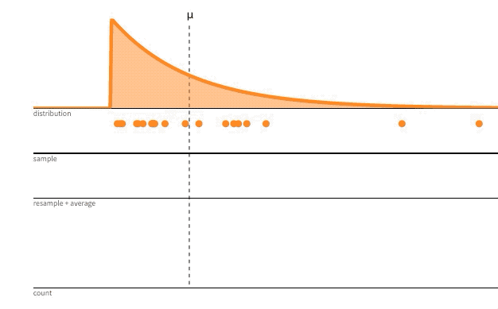
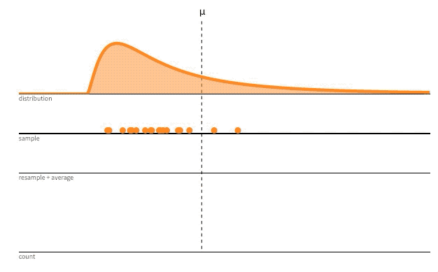

```{r setup, include=FALSE}
# 4:3 divider: <div style='float:left'></div><hr color='#EB811B' size=1px width=796px></html>
# 16:9 divider: <div style='float:left'></div><hr color='#EB811B' size=1px width=1076px></html>
options(htmltools.dir.version = FALSE)
library(gridExtra)
library(tidyverse)
knitr::opts_chunk$set(dev = 'svg')

library(tidyverse)
library(infer)
library(mosaic)

theme_set(theme_light()) # change theme for ggplot2

poll <- data.frame(
  response = rep(c("Water fountain", "Drinking fountain", "Bubbler"), times = c(68, 28, 4))
)
```

#  Estimating standard error

.font120[
- To construct a confidence interval, we need a standard error for the sampling distribution of the statistic

- BUT if we need an SE, then we haven't observed the entire population...
]

--

.font120[
- IF we can assume that the sample is representative of the population, then  We can simulate a sampling distribution by sampling **with replacement** from the original sample!
]

---


# The one-sample bootstrap

.font120[
Let *n* be the sample size.

1. Draw a **bootstrap (re)sample** of size *n* with replacement from the sample

2. Compute the statistic of interest (this is called the **bootstrap statistic**)

3. Repeat steps 1 and 2 many times—say 1,000 or 10,000

4. Create the **bootstrap distribution**

]

---

# The one-sample bootstrap

.center[]

.footnote[https://www.stat.auckland.ac.nz/~wild/BootAnim/movies/bootstrap1.mp4]
---

# Your turn: Textbook prices

.font120[

Here is a sample of textbook prices:

.center[$132 ,  $87 ,  $185 ,  $52 ,  $23 ,  $147 ,  $125 ,  $93 ,  $85 ,  $72]

<br>

Which of the following are possible bootstrap resamples?
 
1. $147,  $93,  $23,  $87, $125,  $87,  $87

2. $185,  $78, $147,  $85,  $85,  $72, $185,  $85,  $54, $281

3. $72, $132, $185, $185,  $23,  $93,  $72, $185,  $93, $132
]

---

# Bootstrapping the Carletonian poll

.pull-left[
.font120[
**Original sample statistic:** $\hat{p} = 0.68$

```{r include=FALSE}
boot_poll <- 
  poll %>%
  mutate(response = fct_collapse(response, other = c("Drinking fountain", "Bubbler"))) %>%
specify(response = response, success = "Water fountain") %>%
  generate(reps = 5000, type = "bootstrap") %>%
  calculate(stat = "prop")
```

<br>

**Bootstrap statistics:**

Mean: `r boot_poll %>% pull() %>% mean()`

Standard error: `r boot_poll %>% pull() %>% sd()`
]
]

.pull-right[
```{r echo=FALSE, warning=FALSE, fig.height = 3, fig.width = 4.5, fig.align='center', out.width = 600}
boot_poll %>%
  visualize() +
  ggtitle("Bootstrap distribution")
```
]
<br>

---

# Properties of the bootstrap distribution

.pull-left[
.font120[
The bootstrap distribution can be used to approximate certain properties of the sampling distribution

- shape

- standard error

- bias
]
]

.pull-right[
```{r echo=FALSE, warning=FALSE, fig.height = 3, fig.width = 4.5, fig.align='center', out.width = 600}
boot_poll %>%
  visualize() +
  ggtitle("Bootstrap distribution")
```
]

---

# Properties of the bootstrap distribution

<br>

.center[]

.footnote[https://seeing-theory.brown.edu/frequentist-inference/index.html#section1]
---

# Properties of the bootstrap distribution

<br>

.center[]

.footnote[https://seeing-theory.brown.edu/frequentist-inference/index.html#section1]

---

# Plug-in confidence intervals

.font120[
We can build a **95% bootstrap CI** by “plugging in” the **bootstrap standard deviation** (error) into the CI formula:

$${\rm statistic \pm 2 \times SE}$$


For Carletonian poll: $\hat{p} = 0.68$ and $SE_{\rm boot} \approx `r boot_poll %>% pull() %>% sd() %>% round(3)`$
]

---

# Interpreting confidence intervals

#### Informal
.font120[A range of plausible values for the parameter]

#### Skeleton interpretation (formal)

```{r include=FALSE}
boot_se <- boot_poll %>% pull() %>% sd()
boot_ci <- 0.68 + c(-1, 1) * 2 * boot_se
```

.font120[
We are 95% confident (sure) that the proportion of Carls that say "water fountain" is between `r round(boot_ci[1], 3)` and `r round(boot_ci[2], 3)`.

<br>

Key pieces:

- confidence level
- link to the parameter and population in context
- give the range of plausible values in context

]

---

# What are we confident in?

.font120[**The process** that created the interval!]

---

# What are we confident in?

.font120[Consider **the process** behind a 95% confidence interval.]<br>
https://seeing-theory.brown.edu/frequentist-inference/index.html#section1

.center[]

---

# Bootstrapping the poll results in R

```{r include=FALSE}
poll <- poll %>%
  mutate(answer = fct_collapse(response, other = c("Drinking fountain", "Bubbler"))) %>%
  select(-response)
```


.font120[
Constructing the bootstrap distribution
```{r eval=FALSE}
boot_dsn <- poll %>%
  specify(response = answer, success = "Water fountain") %>% #<<
  generate(reps = 1000, type = "bootstrap") %>%
  calculate(stat = "prop")                                   #<<
```

Creating the histogram
```{r eval=FALSE}
boot_dsn %>%
  visualize() +
  labs(x = "Sample mean")
```

Calculating the standard error
```{r eval=FALSE}
boot_dsn %>% pull() %>% sd()
```
]
