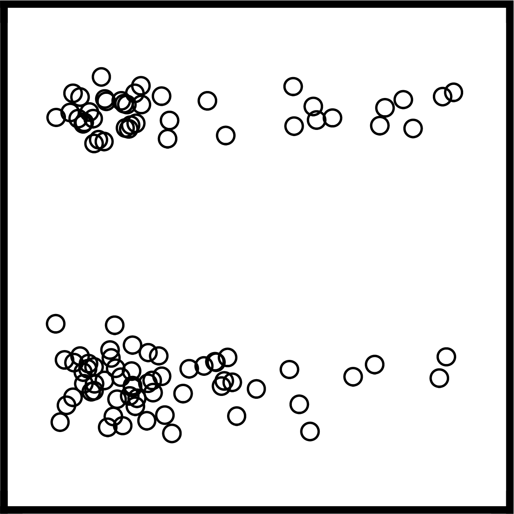
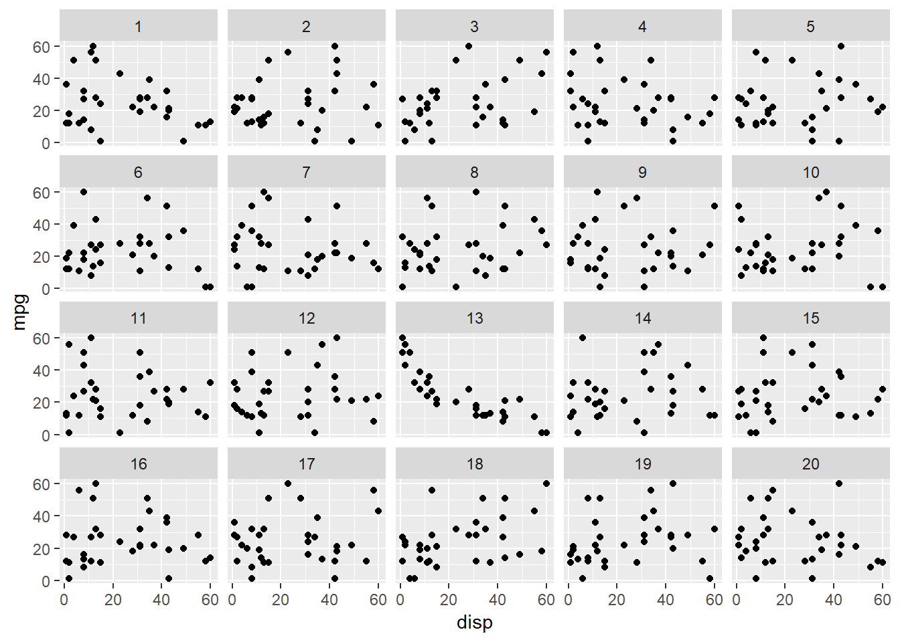
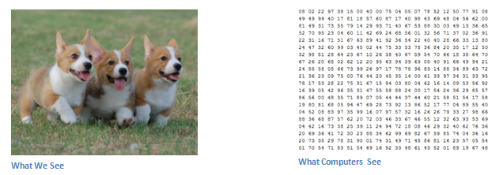

```{r setup, include=FALSE}
options(htmltools.dir.version = FALSE)
knitr::opts_chunk$set(dev = 'svg')
library(knitr)
knitr::opts_chunk$set(cache = TRUE, warning = FALSE, message = FALSE, dpi = 180)
library(ggplot2)
library(broom)
library(dplyr)
library(ggthemes)
library(nullabor)
library(gridExtra)
library(scagnostics)
library(kableExtra)
```

class: inverse, center, middle
<!-- background-image: url(figs/p_and_p_cover.png) -->
<!-- background-size: cover -->

# Can't a computer do that?

<!--  -->
```{r, out.width="25%", echo=FALSE}
include_graphics("figures/Red_camera_eye.svg.png")
```


### Exploring automatic evaluation of statistical graphics

.large[Adam Loy | Gustavus Adolphus MCS Seminar | 30 Sept 2019]


---
class: center, middle


# Have you ever fit a regression model?

--

# Did you check residual plots?

--

# Have you ever seen a residual plot you weren't sure how to interpret?

---

# Sample homework problem


.pull-left[

$\widehat{\tt heart.rate} = b_0 + b_1 \cdot {\tt duration}$

```{r pengiun-scatter, echo=FALSE, fig.height = 4, fig.width = 4}
penguins <- read.csv("http://aloy.rbind.io/data/penguins.csv") 
mod <- lm(log(heart.rate) ~ duration, data = penguins)
aug <- augment(mod)

penguins %>%
  ggplot(aes(x = log(heart.rate), y = duration)) +
  geom_point(shape = 1) +
  geom_smooth(method = "lm") +
  labs(x = "duration of dive (minutes)", 
       y = "heart rate (bpm, log scale)") +
  theme_bw()
```
]

--

.pull-right[

Is there any evidence of structure?

```{r penguin-residuals, echo=FALSE, fig.height = 4, fig.width = 4}
aug %>%
  ggplot(aes(x = duration, y = .resid)) +
  geom_hline(yintercept = 0, linetype = 2, color = "gray30") +
  geom_point(shape = 1) +
  labs(x = "duration of dive (minutes)", y = "Residuals") +
  theme_bw()
```
]

---
class: middle

# apophenia

### the tendency to perceive a connection or meaningful pattern between unrelated or random things (such as objects or ideas)


.footnote[
"apophenia” Meriam-Webster Dictionary Online, September 2019, merriam-webster.com
]

---


background-image: url(figures/usual_suspects.jpg)
background-size: cover 

# <font color="DimGray">The lineup protocol</font>

---

## Which residual plot is not like the others?

```{r resid lineup, echo=FALSE, fig.height = 6, fig.width = 8.5}
# fig.height = 7, fig.width = 9 for full slide
library(nullabor)
set.seed(1234)
lineup_resids <- lineup(null_lm(log.heart.rate. ~ duration, method = "boot"), true = aug)

resid_lineup <- lineup_resids %>%
  ggplot(aes(x = duration, y = .resid)) +
  geom_hline(yintercept = 0, color = "gray60", linetype = 2) +
  geom_point(shape = 1) +
  facet_wrap(~ .sample) +
  theme_bw() +
  theme(axis.title = element_blank(), 
        axis.ticks = element_blank(),
        axis.text = element_blank())
resid_lineup
```

???
Observed plot: `r attr(lineup_resids, "pos")`

---
class: center, middle
# What did we just do?

--

## We compared the **data plot** with **null plots** of samples where, by construction, there really is nothing going on

--

## This allows us to make decisions from our graphics on a firm foundation


---

# Inspiration

.large[
Classical hypothesis testing provides an established framework for inference.


- Formulate two competing hypotheses: $H_0$ and $H_1$.

- Choose a test statistic that characterizes the information in the sample relevant to $H_0$.

- Determine the sampling distribution of the chosen statistic when $H_0$ is true.

- Compare the calculated test statistic to the sampling distribution to determine whether it is "extreme."
]

---

.left-column[
<br>

Hypotheses

<br>

Test statistic

<br>

<br>

<br>

Reference distribution

<br>

<br>

<br>

Evidence against H<sub>0</sub> if...

]

.pull-left[
.bold[Conventional Inference]

H<sub>0</sub>: linear relationship

]

.bold[Visual Inference]

H<sub>1</sub>: nonlinear relationship


---

.left-column[
<br>

Hypotheses

<br>

Test statistic

<br>

<br>

<br>

Reference distribution

<br>

<br>

<br>

Evidence against H<sub>0</sub> if...

]

.pull-left[
.bold[Conventional Inference]

H<sub>0</sub>: linear relationship

<br>

Nested F-test

M1: $E(Y|X) = \beta_0 + \beta_1x$

M2: $E(Y|X) = \beta_0 + \beta_1x + \beta_2x^2$


]

.bold[Visual Inference]

H<sub>1</sub>: nonlinear relationship

--

```{r plot as statistic, out.width="20%", echo=FALSE, fig.height = 2, fig.width = 2}
aug %>%
  ggplot(aes(x = duration, y = .resid)) +
  geom_hline(yintercept = 0, linetype = 2, color = "gray30") +
  geom_point(shape = 1) +
  theme_bw() +
  theme(axis.title = element_blank(), 
        axis.ticks = element_blank(),
        axis.text = element_blank())
```

---

.left-column[
<br>

Hypotheses

<br>

Test statistic

<br>

<br>

<br>

Reference distribution

<br>

<br>

<br>

Evidence against H<sub>0</sub> if...

]

.pull-left[
.bold[Conventional Inference]

H<sub>0</sub>: linear relationship

<br>

Nested F-test

M1: $E(Y|X) = \beta_0 + \beta_1x$

M2: $E(Y|X) = \beta_0 + \beta_1x + \beta_2x^2$

```{r echo=FALSE, fig.height=2, fig.width=2, out.width = "45%"}
mod2 <- update(mod, . ~ . + I(duration^2))

tibble(x = c(0.00000001, 10))  %>%
  ggplot(aes(x = x)) +
  stat_function(fun = df, args = list(df1 = 3, df2 = 5), n = 10000) +
  theme_light() +
  theme(axis.title = element_blank())
```


]

.bold[Visual Inference]

H<sub>1</sub>: nonlinear relationship

```{r plot as statistic, out.width="20%", echo=FALSE, fig.height = 2, fig.width = 2}
```

--

```{r , dev = 'svg', echo=FALSE, fig.height = 5, fig.width = 6.5, out.width = "33%"}
resid_lineup
```

---

.left-column[
<br>

Hypotheses

<br>

Test statistic

<br>

<br>

<br>

Reference distribution

<br>

<br>

<br>

Evidence against H<sub>0</sub> if...

]

.pull-left[
.bold[Conventional Inference]

H<sub>0</sub>: linear relationship

<br>

Nested F-test

M1: $E(Y|X) = \beta_0 + \beta_1x$

M2: $E(Y|X) = \beta_0 + \beta_1x + \beta_2x^2$

```{r echo=FALSE, fig.height=2, fig.width=2, out.width = "45%"}
mod2 <- update(mod, . ~ . + I(duration^2))

tibble(x = c(0.00000001, 10))  %>%
  ggplot(aes(x = x)) +
  stat_function(fun = df, args = list(df1 = 3, df2 = 5), n = 10000) +
  theme_light() +
  theme(axis.title = element_blank())
```

<br>


the test statistic is "extreme"

]

.bold[Visual Inference]

H<sub>1</sub>: nonlinear relationship

```{r plot as statistic, out.width="20%", echo=FALSE, fig.height = 2, fig.width = 2}
```

```{r , dev = 'svg', echo=FALSE, fig.height = 5, fig.width = 6.5, out.width = "33%"}
resid_lineup
```

--

the data plot is identifiable

---
class: clear

### Which Q-Q plot is most different?

```{r qqplot lineup, echo=FALSE, fig.height = 6, fig.width = 8.5}
dframe <- data.frame(x = rchisq(30, df = 2))

qqlineup_data <- lineup(method = null_dist("x", dist = "norm", params = list(mean = 0, sd = 1)), true = dframe)

qqplot_lineup <- qqlineup_data %>%
  ggplot(aes(sample = x)) +
  geom_qq_line() +
  geom_qq() +
  facet_wrap(~ .sample) +
  theme_bw() +
  theme(axis.title = element_blank(), 
        axis.ticks = element_blank(),
        axis.text = element_blank())
qqplot_lineup
```

???

Observed plot: `r attr(qqlineup_data, "pos")`

---
class: clear

### Is it rude to bring a baby on a plane?

```{r bar lineup, echo=FALSE, fig.height = 6, fig.width = 8.5}
data("fly", package = "ggmosaic")

fly_data <- fly %>%
  select(Gender, RudeToBringBaby) %>%
  na.omit()

library(ggmosaic)
bar_lineup_data <- lineup(method = null_permute("RudeToBringBaby"), true = fly_data) 

bar_lineup <- bar_lineup_data %>%
  ggplot() +
    geom_mosaic(aes(x = product(RudeToBringBaby, Gender), fill = RudeToBringBaby)) +
  facet_wrap(~ .sample, ncol = 5) +
  scale_fill_colorblind() +
  theme_bw() +
  theme(legend.position = "top") +
  theme(axis.title = element_blank())
bar_lineup
```

???

Observed plot: `r attr(bar_lineup_data, "pos")`

---
class: middle, center

# That's a neat idea, but where does it fit into my workflow?

---

# Applications of visual inference

.large[
1. Model diagnostics

2. Interpreting unfamiliar plots

3. When large-sample theory breaks down

4. Conducting research in (statistical) graphics
]

---
class: middle, center

# That's great! 

--

# Can you train a computer do this?

---

# How?

.large[
We have to turn plot evaluation into a classification problem...

.pull-left[

.center[Good residual plot]

```{r fig.height = 3, fig.width = 3, echo=FALSE, fig.align='center'}
set.seed(127698)
n <- 54      # sample size
x <- runif(n, min = 0, max = 50)
y.good <- 3 + 0.25 * x + rnorm(n, sd = 1.25)

sim_df <- data.frame(x = x, y = y.good)

mod <- lm(y ~ x, data = sim_df)

ggplot(data = augment(mod)) +
  geom_hline(yintercept = 0, color = "gray60", linetype = 2) +
  geom_point(mapping = aes(y = .resid, x = .fitted)) +
  theme_minimal() +
  theme(axis.title.x=element_blank(),
        axis.text.x=element_blank(), 
        axis.ticks.x=element_blank(), axis.title.y=element_blank(),
        axis.text.y=element_blank(), axis.ticks.y=element_blank()) + 
  theme(legend.position = "none")
```


]


.pull-right[

.center[Bad residual plot]

```{r bad residuals, fig.height = 3, fig.width = 3, echo=FALSE, fig.align='center'}
bad_mod <- lm(heart.rate ~ duration, data = penguins)
augment(bad_mod) %>%
  ggplot(aes(x = duration, y = .resid)) +
  geom_hline(yintercept = 0, color = "gray60", linetype = 2) +
  geom_point() +
  theme_minimal() +
  theme(axis.title.x=element_blank(),
        axis.text.x=element_blank(), 
        axis.ticks.x=element_blank(), axis.title.y=element_blank(),
        axis.text.y=element_blank(), axis.ticks.y=element_blank()) + 
  theme(legend.position = "none")
```

]
]

---

# How can we model this?

.large[
1. Statistical paradigm

  + Logistic regression
  
  + .bold[Random forests]
  
  + Support vector machines (SVMs)

2. Computer vision paradigm

  + Neural networks
]

---
class: middle, center
# Statistical modeling

## work with Cari Comnick, Logan Crowl, Sophia Gunn, Aidan Mullan

---

# Major questions

.pull-left[

1. What's the response?

2. **What are the predictors?**

3. How are we going to relate the two?

4. Does that model fit? 

5. How well does this model perform?
]

<br>
Good or bad class label

--

Hmm... that's hard

--

We'll use a random forest

--

<br>
Be sure to check your model

--

Need to gauge predictive accuracy

---
class: middle, center

# How can we summarize key features/characteristics of scatterplots?

--

# Summary statistics are not the answer!

---
class: center, middlep

background-image: url(figures/Datasaurus12.png)
background-size: cover 


---

# Scagnostics (scatterplot diagnostics)

.large[
- Originally proposed by Tukey & Tukey (1985)
 
- Original idea was to provide indices to help guide exploration of a large scatterplot matrix
 
- Wilkinson, Anand, & Grossman (2005) proposed 9 graph-theoretic metrics
 
- Wilkinson & Wills (2008) explored the distribution of scagnostics on different classes of scatterplots
]


---

.left-column[
# Shape
## Stringy
]

.right-column[

.pull-left[
```{r echo=FALSE, out.width = "70%", fig.align='right'}

```

```{r echo=FALSE, out.width = "70%", fig.align='right'}
include_graphics("img/stringyMedium.png")
```

```{r echo=FALSE, out.width = "70%", fig.align='right'}

```
]

.pull-right[

.Large[
<br>

Low

<br>
<br>
<br>


Medium

<br>
<br>
<br>

High
]
]


]

???

Diameter / length of the MST

---

.left-column[
# Shape
## Stringy
## Skinny
]

.right-column[

.pull-left[
```{r echo=FALSE, out.width = "70%", fig.align='right'}

```

```{r echo=FALSE, out.width = "70%", fig.align='right'}
include_graphics("img/skinnyMedium.png")
```

```{r echo=FALSE, out.width = "70%", fig.align='right'}

```
]

.pull-right[
.Large[
<br>

Low

<br>
<br>
<br>


Medium

<br>
<br>
<br>

High
]
]
]

???

$1 - \dfrac{\sqrt{4\pi \cdot area(A)}}{perimeter(A)}$

---

.left-column[
# Shape

## Stringy
## Skinny
## Convex

]

.right-column[

.pull-left[
```{r echo=FALSE, out.width = "70%", fig.align='right'}

```

```{r echo=FALSE, out.width = "70%", fig.align='right'}

```

```{r echo=FALSE, out.width = "70%", fig.align='right'}

```
]


.pull-right[
.Large[
<br>

Low

<br>
<br>
<br>


Medium

<br>
<br>
<br>

High
]
]
]

???

area(alpha hull)/area(convex hull)


---

.left-column[
# Association
## Monotonic
]

.right-column[

.pull-left[
```{r echo=FALSE, out.width = "70%", fig.align='right'}
include_graphics("img/monotonicLow.png")
```

```{r echo=FALSE, out.width = "70%", fig.align='right'}
include_graphics("img/monotonicMedium.png")
```

```{r echo=FALSE, out.width = "70%", fig.align='right'}

```
]

.pull-right[
.Large[
<br>

Low

<br>
<br>
<br>


Medium

<br>
<br>
<br>

High
]
]
]

???

spearman rank correlation squared


---

.left-column[
# Density
## Outlying
]

.right-column[

.pull-left[
```{r echo=FALSE, out.width = "70%", fig.align='right'}
include_graphics("img/outlyingLow.png")
```

```{r echo=FALSE, out.width = "70%", fig.align='right'}

```

```{r echo=FALSE, out.width = "70%", fig.align='right'}

```
]

.pull-right[
.Large[
<br>

Low

<br>
<br>
<br>


Medium

<br>
<br>
<br>

High
]
]
]


???

$\dfrac{length(T_{(outliers)})}{length(T)}$


---

.left-column[
# Density
## Outlying
## Sparse
]

.right-column[

.pull-left[
```{r echo=FALSE, out.width = "70%", fig.align='right'}
include_graphics("img/sparseLow.png")
```

```{r echo=FALSE, out.width = "70%", fig.align='right'}
include_graphics("img/sparseMedium.png")
```

```{r echo=FALSE, out.width = "70%", fig.align='right'}
include_graphics("img/sparseHigh.png")
```
]

.pull-right[
.Large[
<br>

Low

<br>
<br>
<br>


Medium

<br>
<br>
<br>

High
]
]
]


---

.left-column[
# Density
## Outlying
## Sparse
## Skewed
]

.right-column[

.pull-left[
```{r echo=FALSE, out.width = "70%", fig.align='right'}

```

```{r echo=FALSE, out.width = "70%", fig.align='right'}

```

```{r echo=FALSE, out.width = "70%", fig.align='right'}
include_graphics("img/skewedHigh.png")
```
]

.pull-right[
.Large[
<br>

Low

<br>
<br>
<br>


Medium

<br>
<br>
<br>

High
]
]
]

---

.left-column[
# Density
## Outlying
## Sparse
## Skewed
## Clumpy

]

.right-column[

.pull-left[
```{r echo=FALSE, out.width = "70%", fig.align='right'}

```

```{r echo=FALSE, out.width = "70%", fig.align='right'}

```

```{r echo=FALSE, out.width = "70%", fig.align='right'}
include_graphics("img/clumpyHigh.png")
```
]

.pull-right[
.Large[
<br>

Low

<br>
<br>
<br>


Medium

<br>
<br>
<br>

High
]
]
]


---

.left-column[
# Density
## Outlying
## Sparse
## Skewed
## Clumpy
## Striated
]

.right-column[

.pull-left[
```{r echo=FALSE, out.width = "70%", fig.align='right'}
include_graphics("img/striatedLow.png")
```

```{r echo=FALSE, out.width = "70%", fig.align='right'}
include_graphics("img/striatedMedium.png")
```

```{r echo=FALSE, out.width = "70%", fig.align='right'}
include_graphics("img/StriatedHigh.png")
```
]

.pull-right[
.Large[
<br>

Low

<br>
<br>
<br>


Medium

<br>
<br>
<br>

High
]
]
]


---


.pull-left[
```{r echo=FALSE, fig.width=4, fig.height=4, out.width="75%", fig.align='center'}
library(datasauRus)
datasaurus_dozen %>% 
  filter(dataset == 'slant_up') %>% 
  ggplot(aes(x=x, y=y))+
  geom_point() +
  theme_minimal() +
  theme(axis.title.x=element_blank(),
        axis.text.x=element_blank(), 
        axis.ticks.x=element_blank(), axis.title.y=element_blank(),
        axis.text.y=element_blank(), axis.ticks.y=element_blank()) + 
  theme(legend.position = "none")

slant_up_df <- datasaurus_dozen %>% 
  filter(dataset == 'slant_up')
```

```{r echo=FALSE, results='asis'}
slant_scag <- as.data.frame(scagnostics(slant_up_df[,-1])[1:9])
colnames(slant_scag) <- "value"
kable(slant_scag, row.names = TRUE, format = "html", col.names = NULL, digits = 4) %>%
  row_spec(c(1, 4, 5, 9), bold = F, color = "black", background = "white") %>%
  row_spec(c(2:3, 7,8), bold = T, color = "black", background = "silver") %>%
  row_spec(6, bold = T, color = "black", background = "gainsboro")
```


]


.pull-right[
```{r echo=FALSE, fig.width=4, fig.height=4, out.width="75%", fig.align='center'}
datasaurus_dozen %>% 
  filter(dataset == 'away') %>% 
  ggplot(aes(x=x, y=y))+
  geom_point()+
  theme_minimal() +
  theme(axis.title.x=element_blank(),
        axis.text.x=element_blank(), 
        axis.ticks.x=element_blank(), axis.title.y=element_blank(),
        axis.text.y=element_blank(), axis.ticks.y=element_blank()) + 
  theme(legend.position = "none")
```

```{r echo=FALSE, results='asis'}
away_df <- datasaurus_dozen %>% 
  filter(dataset == 'away')
away_scag <- as.data.frame(scagnostics(away_df[,-1])[1:9])
colnames(away_scag) <- "value"
kable(away_scag, row.names = TRUE, format = "html", col.names = NULL, digits = 4) %>%
  row_spec(c(1, 4, 5, 9), bold = F, color = "black", background = "white") %>%
  row_spec(c(2:3, 7,8), bold = T, color = "black", background = "gainsboro") %>%
  row_spec(6, bold = T, color = "black", background = "silver")
```


]

---
class: middle, center

# Random forests 

---

# Classification trees

```{r out.width = "60%", fig.align='center', echo=FALSE}

```


---

.large[Start with all observations in one group]

```{r include=FALSE}
library(readr)
linear <- read_csv("data/linear2_scagnostics.csv", 
                   col_names = c("index", "x1", "id", 
                                 "outlying", "skewed", "clumpy", "sparse",
                                 "striated", "convex", "skinny", "stringy",
                                 "monotonic", "signal")) %>%
  select(-1) %>%
  slice(-1) %>%
  mutate(type = "linear")

expo <- read_csv("data/Exponential_Scagnostics.csv", 
                   col_names = c("index", "id", 
                                 "outlying", "skewed", "clumpy", "sparse",
                                 "striated", "convex", "skinny", "stringy",
                                 "monotonic", "signal")) %>%
  select(-1) %>%
  slice(-1) %>%
  mutate(type = "expo") %>%
  mutate_at(.vars = 2:10, .funs = as.numeric)


scag <- bind_rows(linear, expo)

set.seed(234789)
scag_sample <- scag %>%
  group_by(signal, type) %>%
  sample_n(50) %>%
  mutate(class = ifelse(signal == 0, "noise", ifelse(type == "expo", "exponential", "linear")))

library(rpart) 

tree_fit <- rpart(
  signal ~ outlying + skewed + clumpy + sparse +striated + convex + skinny + stringy + monotonic, 
  data=scag_sample
)

```

```{r echo=FALSE, fig.width = 6, fig.height = 5, fig.align='center'}
ggplot(scag_sample, aes(x = monotonic, y = outlying, color = class, shape = class)) +
  geom_point() +
  scale_color_colorblind() +
  theme_light() +
  lims(x = c(0,1))
```

--

.large[Find the variable/split that best separates the classes]


---

.large[Find the variable/split that best separates the classes]

```{r echo=FALSE, fig.width = 6, fig.height = 5, fig.align='center'}
ggplot(scag_sample, aes(x = monotonic, y = outlying, color = class, shape = class)) +
  geom_point() +
  geom_vline(xintercept = 0.08055125, size = 1) +
  scale_color_colorblind() +
  theme_light() +
  lims(x = c(0,1))
```

--

.large[Within each split, find the best variable/split that separates the outcomes]

---

.large[Within each split, find the best variable/split that separates the outcomes]

```{r echo=FALSE, fig.width = 6, fig.height = 5, fig.align='center'}
ggplot(scag_sample, aes(x = monotonic, y = outlying, color = class, shape = class)) +
  geom_point() +
  geom_vline(xintercept = 0.08055125, size = 1) +
  geom_segment(aes(y = 0.4197894, yend = 0.4197894, x = 0.08055125, xend = 1), inherit.aes = FALSE) +
  scale_color_colorblind() +
  theme_light() +
  lims(x = c(0,1))
```

--

.large[Continue until the groups are too small or sufficiently "pure"]


---

# Visualizing the tree

```{r echo=FALSE, out.width = "70%", fig.align='center'}
library(partykit)
plot(as.party(tree_fit))
```


---

# Classification trees
.large[
.pull-left[
**Advantages**

- Easy to explain 

- May more closely mirror human decision-making than other approaches 

- Can be displayed graphically, and are easily interpreted even by a non-expert (especially if they are small) 

- Can easily handle categorical predictors 
]

.pull-right[
**Disadvantages**

- Generally do not have the same level of predictive accuracy as many other classification  approaches 

- High variability
]
]

---

# Growing a random forest

.large[
- Sample with replacement from your training data set to get B bootstrapped training sets

- Grow a tree for each of the B training sets (grow deep, don't prune)

    + For each split only consider a random sample of m out of p predictors


- Majority (plurality) vote to classify an observation
]

---
background-image: url(figures/ex_random_forest.png)
background-size: contain 


---

# Training data: 14865 signal plots

```{r echo=FALSE}
family_theme <- theme_light() +
  theme(panel.grid = element_blank(),
  axis.text = element_blank(), 
  axis.title = element_blank(), 
  axis.ticks = element_blank()
  )

striated_plots <- read_csv("data/striated_plots.csv")
plotSigStriate <- striated_plots[which(striated_plots$ID == 527),]


ex1 <- ggplot(plotSigStriate) + 
  geom_point(aes(x, y), shape = 1) + 
  family_theme 

linear_plots <- read_csv("data/linear2_plots.csv")
plotSigLinear <- linear_plots[which(linear_plots$ID == 530),]
ex2 <- ggplot(plotSigLinear) + 
  geom_point(aes(x, y), shape = 1) + 
  family_theme 

plotNull <- linear_plots[which(linear_plots$ID == 1866),]
ex_null <- ggplot(plotNull) +
  geom_point(aes(x, y), shape = 1) + 
  family_theme 

quad_plots <- read_csv("data/quad_plots.csv")
plotSigQuad <- quad_plots[which(quad_plots$ID == 309),]
ex3<- ggplot(plotSigQuad) + 
  geom_point(aes(x, y), shape = 1) + 
  family_theme

funnel_plots <- read_csv("data/funnel_trend_plots.csv")
plotSigFunnel <- funnel_plots[which(funnel_plots$ID == 814),]
ex4 <- ggplot(plotSigFunnel) + 
  geom_point(aes(x, y), shape = 1) + 
  family_theme

exponential_plots <- read_csv("data/Exponential_Plots.csv")
plotSigExponential <- exponential_plots[which(exponential_plots$ID == 824),]
ex5 <- ggplot(plotSigExponential) + 
  geom_point(aes(x, y), shape = 1) + 
  family_theme

cluster_plots <- read_csv("data/Cluster_Plots_Redo.csv")
plotSigCluster <- cluster_plots[which(cluster_plots$ID == 5621),]
ex6 <- ggplot(plotSigCluster) + 
  geom_point(aes(x, y), shape = 1) + 
  family_theme

ts_plots <- read_csv("data/TS_Plots.csv")

plotNullTS <- ts_plots[which(ts_plots$ID == 296),]
ex_null2 <- ggplot(plotNullTS) + 
  geom_point(aes(x, y), shape = 1) + 
  family_theme
```

```{r echo=FALSE, fig.width = 9, fig.height = 6, out.width = "100%"}
grid.arrange(ex1, ex2, ex3, ex4, ex5, ex6, ncol = 3)
```

---

#Training data: 14865 null plots

```{r echo=FALSE, fig.width = 6, fig.height = 3, fig.align='center'}
grid.arrange(ex_null, ex_null2, ncol = 2)
```

---

# Model evaluation
.large[
- Generated 1000 signal plots

- Calculated the 9 scagnostics on each

- Used random forest to classify as "signal" or "noise"
]

--

.content-box-blue[
.large[972 of the 1000 signal plots were correctly classified]
]

--

.content-box-yellow[
.large[
Also evaluated on 1000 lineups of size 20, with unspecified number of signal plots

- 93.5% of linear plots identified as signal; 5.3% false positive rate
]
]


---
class: middle, center
# Computer vision models

---
# Motivation: Giora Simchoni's blog post

```{r echo=FALSE}
knitr::include_graphics("figures/giora-blog.png")
```

---

## Giora trained a computer vision model two ways

.Large[
- classification: significant correlation vs not

- regression: to predict the correlation
]

---
class: clear

## Success, picked plot 16

```{r echo=FALSE, out.width = "100%"}
include_graphics("img/simchoni_test1.png")
```


---
class: clear

## Success, failed to pick plot 4

```{r echo=FALSE, out.width = "100%"}
include_graphics("img/simchoni_test2.png")
```

---
class: clear

## Fail! Doesn't see the strong nonlinear association. Picks the most linear.

```{r echo=FALSE, out.width = "90%"}

```

---

# Deep learning

```{r echo=FALSE, out.width="95%", fig.align='center'}
include_graphics("img/image_classification.png")
```


.footnote[
Source: [Abdellatif Abdelfattah](https://medium.com/@tifa2up/image-classification-using-deep-neural-networks-a-beginner-friendly-approach-using-tensorflow-94b0a090ccd4)
]

---

# Deep learning

```{r echo=FALSE, out.height=425}
include_graphics("https://miro.medium.com/max/1230/1*DGDcAQmm0e0kW_1iON1e-Q.jpeg")
```


.footnote[Source: [Chihuahua or Muffin? Brad Folkens](https://blog.cloudsight.ai/chihuahua-or-muffin-1bdf02ec1680)]


---

## Neural networks

- $x_i$ = input variable

- $v_j$ = function of linear combinations of the inputs (e.g. sigmoid)

- $y_k$ = function of linear combinations of the $v_j$ (e.g. softmax)

```{r echo=FALSE, out.width = "70%", fig.align='center'}
include_graphics("img/nn_simple.png")
```

.footnote[
.scriptsize[Source: [Cheng & Titterington (1994)](https://projecteuclid.org/euclid.ss/1177010638)]
]
???

Derived features Zm are created from linear combinations of the inputs, and then the target Yk is modeled as a function of linear combinations of the Zm

---

# Regression as a neural network

```{r echo=FALSE, out.width = "70%", fig.align='center'}

```

.footnote[
.scriptsize[Source: [Cheng & Titterington (1994)](https://projecteuclid.org/euclid.ss/1177010638)]
]

---

# Images as data

```{r echo=FALSE, out.width = "100%", fig.align='center'}

```

---

# Filtering patterns

```{r echo=FALSE, out.width = "100%", fig.align='center'}

```

.footnote[
Source: [Deep Learning with R](https://www.manning.com/books/deep-learning-with-r)
]

---

# Pooling to find spatial hierarchies

```{r echo=FALSE, out.width = "100%", fig.align='center'}
include_graphics("img/covnet2.jpg")
```

.footnote[
Source: Di Cook's [DSSV slides](http://www.dicook.org/files/dssv19/slides#1)
]

???
to induce spatial-filter hierarchies 

---

# Rinse & repeat to reveal other hierarchies

```{r echo=FALSE, out.width = "80%", fig.align='center'}
include_graphics("img/covnet1.jpg")
```

.footnote[
Source: Di Cook's [DSSV slides](http://www.dicook.org/files/dssv19/slides#1)
]

---
background-image: url(img/nn_cat.png)
background-size: cover

---

# Approach I

.large[
- Save the scatterplots as images, then train your CNN

- Di Cook and Shuofan Zhang at Monash University worked on this to detect linearity

- Trained Keras model with 60,000 training data sets for each class: linear vs. not

- Accuracy with simulated test data, 93% 
    + null error 0.0179
    + linear error 0.1176
]


---

# Approach II

.large[ 
- Create images showing the "shape" of the scatterplot, then train your CNN

.pull-left[
```{r echo=FALSE, out.width = "70%", fig.align='center'}

```
]

.pull-right[
```{r echo=FALSE, out.width = "70%", fig.align='center'}
include_graphics("img/nn_hulls2.png")
```
]

- Elliot Pickens and I worked on this last spring
]

---

# Approach II
.large[
Trained Keras model on simulated 300 plots for each class

4200 total plots in the training set

.pull-left[
- **Uniform**

- **Spherical** 

- **Binormal** 

- **Funnel** 

- **Exponential**
]

.pull-right[

- **Quadratic** 

- **Clustered** 

- **Doughnut** 

- **Stripe** 

- **Sparse** 
]
]

???
1. **Uniform** (2D Poisson process)
2. **Spherical** (spherical normal)
3. **Binormal** (bivariate normal with $\rho = \pm 0.6$)
4. **Funnel** (bivariate log-normal with $\rho = \pm 0.6$)
5. **Exponential** (exponential growth/decay plus random error)
6. **Quadratic** (positive/negative quadratic function plus random error)
7. **Clustered** (three separated spherical normals at the vertices of an equilateral triangle)
8. **Doughnut** (two polar uniforms separated by a moat of white space)
9. **Stripe** (product of Uniform and integer [1, 5])
10. **Sparse** (product of integer [1, 3] with itself)

---

## Approach II

.pull-left[
.large[
- 2100 images in the testing set (150 per class)

- Precision = true positive

- Recall = sensitivity
]
]

.pull-right[
Class | Precision | Recall
------|---|---
Uniform | 0.97 | 0.99 
Spherical | 0.70 | 0.61 
Binormal | 0.85 | 0.81 
N. Binormal | 0.96 | 0.87 
Funnel | 0.96 | 0.90 
N. Funnel | 0.94 | 0.93 
N. Expo | 0.97 | 0.99 
Expo | 0.97 | 0.97 
Quadratic | 0.96 | 0.97 
Clustered | 0.73 | 0.83 
Doughnut  | 0.73  | 0.83 
Stripe | 0.89  | 0.98 
Sparse | 1.00 | 1.00 
Logarithmic | 0.99 | 0.92 
]


???
Avg. precision and recall is  about 90%


Precision = proportion of plots classified as uniform that are actually uniform

Recall = proportion of uniform plots that were actually predicted to be uniform


---

# Discussion

.large[
- It's possible to automate the detection of plots, but the training sets are key

- If you use a statistical model/algorithm, you need to carefully consider your predictors

- Computer's haven't beaten human ability to detect plot type (Cook & Zhang)

- Promising results for model diagnosis, exploring large data sets, and prototyping new statistical graphics
]

---

# Joint work
.large[
#### Deep learning:  
[Giora Simchoni](http://giorasimchoni.com/2018/02/07/2018-02-07-book-em-danno/); [Di Cook](http://www.dicook.org/) & Shuofan Zhang; Elliot Pickens


#### Inference: 
Di Cook, Heike Hofmann, [Mahbub Majumder](http://mamajumder.github.io/html/experiments.html), Andreas Buja, Hadley Wickham, Eric Hare, [Susan Vanderplas](https://srvanderplas.netlify.com/), Niladri Roy Chowdhury, Nat Tomasetti


#### Contact: 
[`r icon::fa_envelope(color = "black")`](https://aloy.rbind.io/) aloy@carleton.edu [`r icon::fa_github(color = "black")`](https://github.com/aloy) aloy

]
---

# Further reading

.large[
- Buja et al (2009) Statistical Inference for Exploratory Data Analysis and Model Diagnostics, *Roy. Soc. Ph. Tr., A*

- Majumder et al (2013) Validation of Visual Statistical Inference, Applied to Linear Models, *JASA*

- Wickham et al (2010) Graphical Inference for Infovis, *InfoVis*

- Hofmann et al (2012) Graphical Tests for Power Comparison of Competing Design, *InfoVis*

- Loy et al (2017) Model Choice and Diagnostics for Linear Mixed-Effects Models Using Statistics on Street Corners, *JCGS*

]

