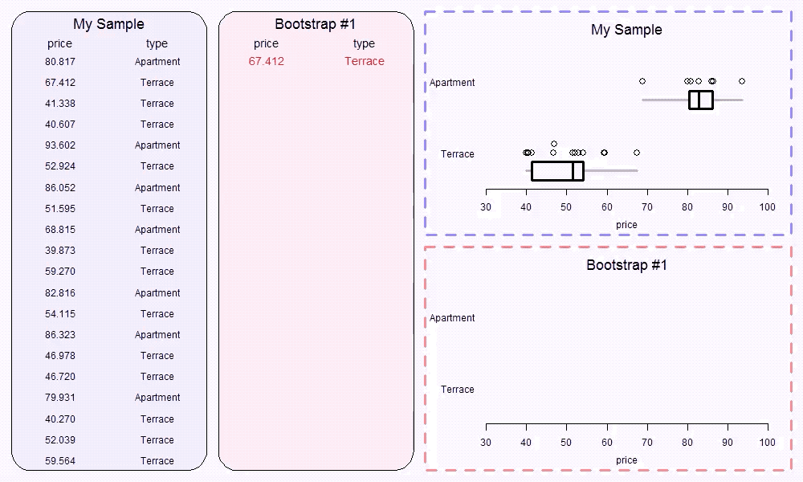

```{r setup, include=FALSE}
# 4:3 divider: <div style='float:left'></div><hr color='#EB811B' size=1px width=796px></html>
# 16:9 divider: <div style='float:left'></div><hr color='#EB811B' size=1px width=1076px></html>
options(htmltools.dir.version = FALSE)
library(gridExtra)
library(tidyverse)
knitr::opts_chunk$set(dev = 'svg')

library(tidyverse)
library(infer)
library(mosaic)
library(viridis)
library(ggthemes)

pisa <- read.csv("14-PISA.csv")
pisa2 <- filter(pisa, Country != "Spain") %>%
  mutate(Country = forcats::fct_drop(Country))
```

# Example: PISA

.font120[
- The Program for International Student Assessment  (PISA) is an international exam that is administered to 15-year-old students in many different countries every three years.

- 515,958 students from around the world took the 2009 PISA. 

- A random sample from those students was taken from the United States and Finland, each with a sample size of 100. 

- **How large are the differences in student performance on the PISA exam for the United States and Finland?**
]

---

# EDA

```{r echo=FALSE, fig.height=3.5, fig.width=7, fig.align='center'}
pisa_means <- pisa2 %>%
  group_by(Country) %>%
  summarize(mean = mean(Score))

ggplot(data = pisa2) +
  geom_boxplot(mapping = aes(x = Country, y = Score, fill = Country), alpha = 0.5) +
  geom_point(mapping = aes(x = Country, y = mean), data = pisa_means) +
  scale_fill_viridis_d() +
  coord_flip() +
  theme_light()
```

.font120[
```{r results='asis', echo=FALSE}
knitr::kable(favstats(Score ~ Country, data = pisa2), format = 'html')
```
]

---

# Two-sample bootstrap

.font120[
1. Draw a random sample of *n<sub>1</sub>* observations, with replacement, from the original sample for the first group.

2. Draw a random sample of *n<sub>2</sub>* observations, with replacement, from the original sample for the second group.

3. Calculate the statistic of interest from these bootstrap samples (e.g., the difference in means). This statistic is called a bootstrap statistic.

4. Repeat steps 1-3 many times, say 5,000.

5. Combine all of the bootstrap statistics to form the bootstrap distribution. 
]

---

# Two-sample bootstrap

.center[]

.footnote[https://www.stat.auckland.ac.nz/~wild/BootAnim/movies/bootstrap3-1.mp4]
---
class: clear, middle

```{r echo=FALSE, fig.height=4, fig.width=6, fig.align='center', out.width=700}
boot_dsn <- pisa2 %>%
  specify(Score ~ Country) %>%
  generate(reps = 5000, type = "bootstrap") %>%
  calculate(stat = "diff in means", order = c("Finland", "USA"))

boot_dsn %>%
  visualize(bins = 40) +
  theme_light() +
  labs(x = "Difference in mean scores (Finland - USA)")
```

.font120[
```{r echo=FALSE}
knitr::kable(fav_stats(boot_dsn %>% pull()), format = 'html', digits = 3)
```
]

---

class: middle, inverse, center

# How do we build intervals at other confidence levels?

---

# Percentile method for bootstrap CIs

.font120[
To form $P \times 100$% bootstrap confidence intervals use the following endpoints:

<br>

Lower endpoint: $(1 - P)/2$ percentile

<br>

Upper endpoint: $1 - (1 - P)/2$ percentile
]

---
class: clear

.code100[
```{r}
quantile(boot_dsn %>% pull(), probs = c(0.05, 0.95))
```
]

```{r echo=FALSE, fig.height = 4, fig.width = 6, out.width = 700, fig.align='center'}
pisa_boot_stats <- tibble(
  means = boot_dsn %>% pull(),
  upper.90CI = means >= quantile(means, .95),
  lower.90CI = means <= quantile(means, .05), 
  upper.95CI = means >= quantile(means, .975),
  lower.95CI = means <= quantile(means, .025), 
  upper.99CI = means >= quantile(means, .995),
  lower.99CI = means <= quantile(means, .005),
  ci90 = ifelse(upper.90CI, TRUE, ifelse(lower.90CI, TRUE, FALSE)),
  ci95 = ifelse(upper.95CI, TRUE, ifelse(lower.95CI, TRUE, FALSE)),
  ci99 = ifelse(upper.99CI, TRUE, ifelse(lower.99CI, TRUE, FALSE))
)

pisa_ci90 <- 
  ggplot(data = pisa_boot_stats, mapping = aes(x = means, fill = ci90)) +
  geom_histogram(bins = 60) +
  labs(x="Difference in mean scores (Finland - USA)") +
  scale_fill_viridis_d() +
  theme_light() +
  theme(legend.position="none") +
  ggtitle("90% bootstrap CI")

pisa_ci95 <- 
  ggplot(data = pisa_boot_stats, mapping = aes(x = means, fill = ci95)) +
  geom_histogram(bins = 60) +
  labs(x="Difference in mean scores (Finland - USA)") +
  scale_fill_viridis_d() +
  theme_light() +
  theme(legend.position="none") +
  ggtitle("95% bootstrap CI")

pisa_ci99 <- 
  ggplot(data = pisa_boot_stats, mapping = aes(x = means, fill = ci99)) +
  geom_histogram(bins = 60) +
  labs(x="Difference in mean scores (Finland - USA)") +
  scale_fill_viridis_d() +
  theme_light() +
  theme(legend.position="none") +
  ggtitle("99% bootstrap CI")

pisa_ci90
```


---
class: clear

.code100[
```{r}
quantile(boot_dsn %>% pull(), probs = c(0.025, 0.975))
```
]

```{r echo=FALSE, fig.height = 4, fig.width = 6, out.width = 700, fig.align='center'}
pisa_ci95
```


---
class: clear

.code100[
```{r}
quantile(boot_dsn %>% pull(), probs = c(0.005, 0.995))
```
]

```{r echo=FALSE, fig.height = 4, fig.width = 6, out.width = 700, fig.align='center'}
pisa_ci99
```

---

# Your turn

.font120[
Specify the percentiles that should be used to create confidence intervals at each confidence level

- 89% confidence level

- 96% confidence level
]

---

# Cautions

.font120[
- Percentile intervals should not be used for small samples 

<br>

- Bootstrap distribution should appear to be smooth 

<br>

- Applies to the bootstrap in general
]

---
class: clear

.font120[
Constructing the bootstrap distribution
```{r eval=FALSE}
boot_dsn <- pisa2 %>%
  specify(Score ~ Country) %>% #<<
  generate(reps = 1000, type = "bootstrap") %>%
  calculate(stat = "diff in means", order = c("Finland", "USA")) #<<
```

Creating the histogram
```{r eval=FALSE}
boot_dsn %>%
  visualize(bins = 40) +
  theme_light() +
  labs(x = "Difference in mean scores (Finland - USA)")
```

Calculating a percentile CI
```{r eval=FALSE}
boot_dsn %>% pull() %>% quantile(probs = c(0.05, 0.95))
```
]