```{r setup, include=FALSE}
options(htmltools.dir.version = FALSE)
knitr::opts_chunk$set(dev = 'svg')
library(knitr)
knitr::opts_chunk$set(cache = TRUE, warning = FALSE, message = FALSE, dpi = 180)
library(ggplot2)
library(broom)
library(dplyr)
library(ggthemes)
library(nullabor)
library(gridExtra)
library(scagnostics)
library(kableExtra)
```

class: inverse, center, middle
<!-- background-image: url(figs/p_and_p_cover.png) -->
<!-- background-size: cover -->

# Exploring automatic evaluation of statistical graphics

<!--  -->
```{r, out.width="25%", echo=FALSE}

```


.large[Adam Loy | Graphics Group @ ISU | 3 Oct 2019]


---
class: center, middle


# Have you ever fit a linear mixed-effects model?

--

# Did you check residual plots?

--

# Have you ever seen a residual plot you weren't sure how to interpret?

---

# Example

Suppose you fit a standard two-level, continuous response linear-mixed effects model and see the following residual plots

.pull-left[
.center[
$\widehat{\varepsilon}_i$ vs. x
]

```{r echo=FALSE, out.width = "35%", fig.align='center'}
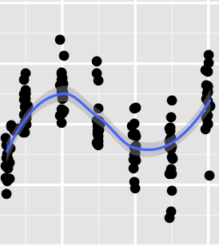
```

.center[
$\widehat{\varepsilon}_i$ vs. x
]

```{r echo=FALSE, out.width = "35%", fig.align='center'}
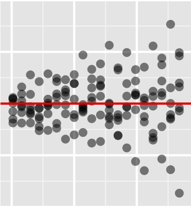
```
]

.pull-right[

.center[
$\widehat{\varepsilon}_i$ by group
]

```{r echo=FALSE, out.width = "35%", fig.align='center'}
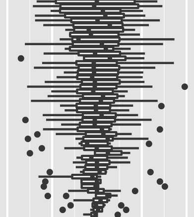
```

.center[
distribution of $\widehat{b}_j$
]

```{r echo=FALSE, out.width = "35%", fig.align='center'}
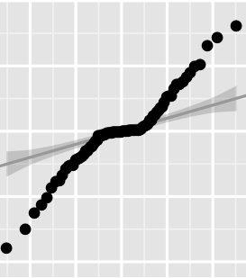
```
]


---
class: middle

# apophenia

### the tendency to perceive a connection or meaningful pattern between unrelated or random things (such as objects or ideas)


.footnote[
"apophenia” Meriam-Webster Dictionary Online, September 2019, merriam-webster.com
]

---


background-image: url(figures/usual_suspects.jpg)
background-size: cover 

# <font color="DimGray">The lineup protocol</font>

---

## Which residual plot is not like the others?

```{r resid lineup, echo=FALSE, out.width = "70%", fig.align='center'}
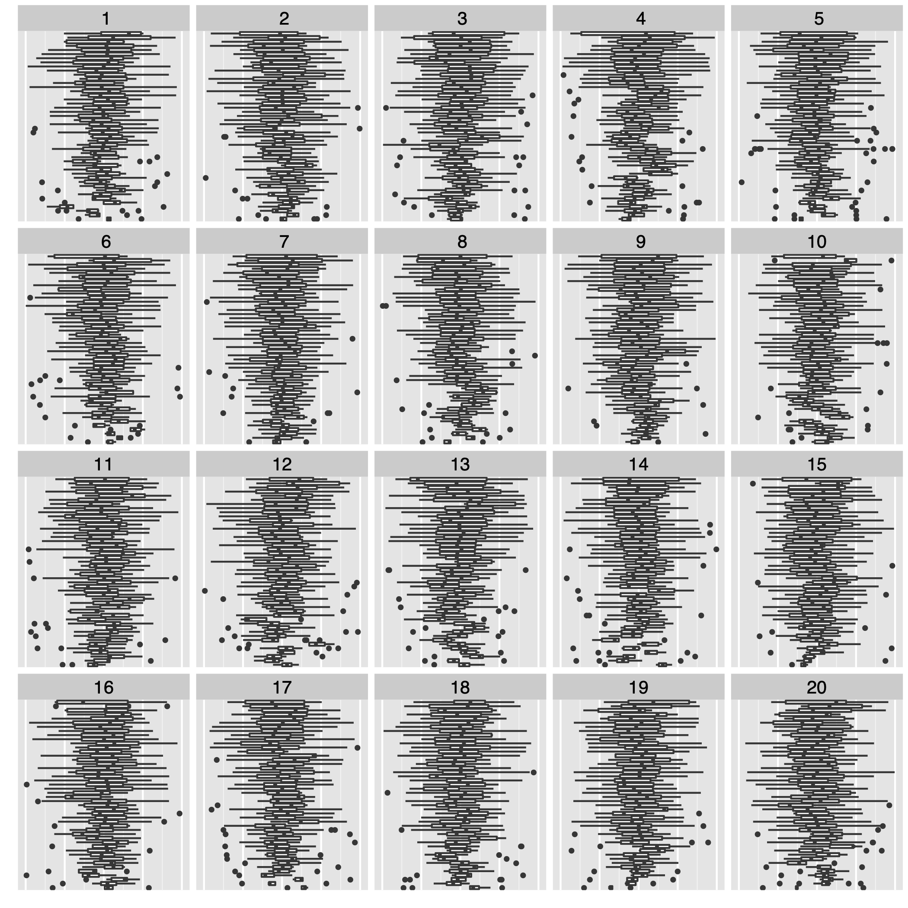
```

???
Observed plot: 10

---
class: center, middle
# What did we just do?

--

## We compared the **data plot** with **null plots** of samples where, by construction, there really is nothing going on

--

## This allows us to make decisions from our graphics on a firm foundation

---
class: middle, center

# That's a neat idea, but where does it fit into my workflow?

---

# Applications of visual inference

.large[
1. Model diagnostics

2. Interpreting unfamiliar plots

3. When large-sample theory breaks down

4. Conducting research in (statistical) graphics
]

---

# Example from Hofmann et al. (2012)

.pull-left[
```{r, echo=FALSE, fig.align='center', out.width = "100%"}
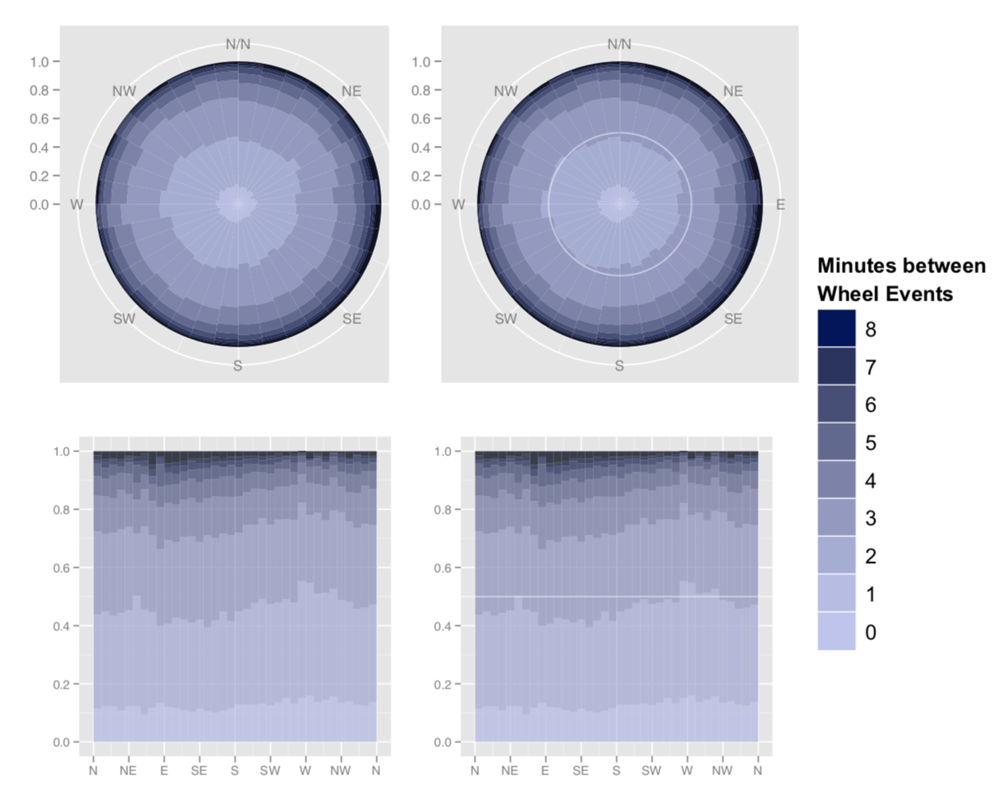
```
]

.pull-right[
1. Create Lineup Data

2. Create lineups from competing designs

3. Evaluate lineups (via MTurk)

4. Evaluate competing designs 


\begin{eqnarray}
Y_i &\sim& \text{Bernoulli}(\pi_i) \nonumber\\
g(\pi_i) &=&  \mu + \underbrace{\tau_{j(i)}}_{\text{plot design}} + \underbrace{\nu_{s(i)}}_{\text{sample size}}  + \cdots\nonumber\\ 
&+& \underbrace{u_{u(i)}}_{\substack{\text{individual} \\ \text{ability}}} + \underbrace{d_{d(i)}}_{\substack{\text{lineup} \\ \text{difficulty}}} \nonumber 
\end{eqnarray}
]


---
class: middle, center

# That's great! 

--

# Can you train a computer do this?

---

# How?

.large[
We have to turn plot evaluation into a classification problem...

.pull-left[

.center[Good residual plot]

```{r fig.height = 3, fig.width = 3, echo=FALSE, fig.align='center'}
set.seed(127698)
n <- 54      # sample size
x <- runif(n, min = 0, max = 50)
y.good <- 3 + 0.25 * x + rnorm(n, sd = 1.25)

sim_df <- data.frame(x = x, y = y.good)

mod <- lm(y ~ x, data = sim_df)

ggplot(data = augment(mod)) +
  geom_hline(yintercept = 0, color = "gray60", linetype = 2) +
  geom_point(mapping = aes(y = .resid, x = .fitted)) +
  theme_minimal() +
  theme(axis.title.x=element_blank(),
        axis.text.x=element_blank(), 
        axis.ticks.x=element_blank(), axis.title.y=element_blank(),
        axis.text.y=element_blank(), axis.ticks.y=element_blank()) + 
  theme(legend.position = "none")
```


]


.pull-right[

.center[Bad residual plot]

```{r bad residuals, fig.height = 3, fig.width = 3, echo=FALSE, fig.align='center'}
bad_mod <- lm(heart.rate ~ duration, data = penguins)
augment(bad_mod) %>%
  ggplot(aes(x = duration, y = .resid)) +
  geom_hline(yintercept = 0, color = "gray60", linetype = 2) +
  geom_point() +
  theme_minimal() +
  theme(axis.title.x=element_blank(),
        axis.text.x=element_blank(), 
        axis.ticks.x=element_blank(), axis.title.y=element_blank(),
        axis.text.y=element_blank(), axis.ticks.y=element_blank()) + 
  theme(legend.position = "none")
```

]
]

---

# How can we model this?

.large[
1. Statistical paradigm

  + Logistic regression
  
  + .bold[Random forests]
  
  + Support vector machines (SVMs)
  
  + ...more..

2. Computer vision paradigm

  + Convolutional neural networks
]

---
class: middle, center
# Statistical modeling

## work with Cari Comnick, Logan Crowl, Sophia Gunn, Aidan Mullan

---

# Major questions

.pull-left[

1. What's the response?

2. **What are the predictors?**

3. How are we going to relate the two?

4. How well does this model perform?
]

<br>
Good or bad class label

--

Hmm... that's hard

--

We'll use a random forest


--

<br>
Need to gauge predictive accuracy

---
class: middle, center

# How can we summarize key features/characteristics of scatterplots?

--

# Summary statistics are not the answer!

---
class: center, middlep

background-image: url(figures/Datasaurus12.png)
background-size: cover 


---

# Scagnostics (scatterplot diagnostics)

.large[
- Originally proposed by Tukey & Tukey (1985)
 
- Original idea was to provide indices to help guide exploration of a large scatterplot matrix
 
- Wilkinson, Anand, & Grossman (2005) proposed 9 graph-theoretic metrics
 
- Wilkinson & Wills (2008) explored the distribution of scagnostics on different classes of scatterplots
]

---

# Geometric graph

- A graph is a set of vertices $V$ which are related by edges $e(v,w)$ in $E$ and $v,w$ in $V$

- A geometric graph can be represented as points and lines in a metric space $S$

.pull-left[
```{r echo=FALSE, out.width = "100%"}
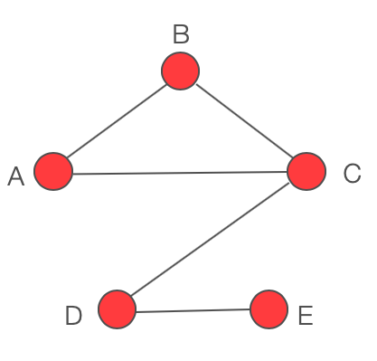
```

]

.pull-right[
$V = \lbrace A,B,C,D,E \rbrace$

$E = \lbrace(A,B), (A,C), (B,C), (C,D), (D,E)\rbrace$

$S = 2$ dimensional space

]

---

# Graphs for Scagnostics

.pull-left[
- Undirected

- Simple

- Planar

- Straight

- Finite
]

.pull-right[
```{r echo=FALSE, out.width = "100%"}

```
]


---

# Measuring features

.content-box-blue[
**Length(e)** is the Euclidean distance between the vertices of an edge $e$

**Length(G)** is the total length of all edges of a graph $G$
]


.pull-left[
```{r echo=FALSE, out.width = "100%"}
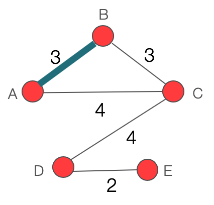
```
]

.pull-right[
$Length(AB) = 3$

$Length(G) = 16$

]
---

# Measuring features

.content-box-blue[
A **path** is a list of vertices such that all successive pairs are an edge
]

.pull-left[
```{r echo=FALSE, out.width = "70%"}
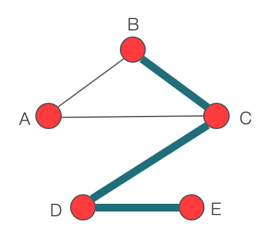
```
]
.pull-right[
```{r echo=FALSE, out.width = "70%"}
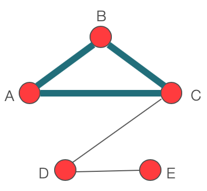
```
]

.content-box-blue[
A **polygon** is the boundary of a closed path
]

---

# Measuring features

.content-box-blue[
.bold[Area(P)] is the area of polygon $P$

.bold[Perimeter(P)] is the length of the boundary of polygon $P$
]

```{r echo=FALSE, out.width = "50%", fig.align='center'}
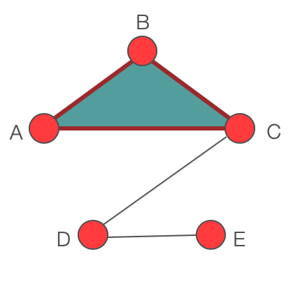
```

---

# Scagnostic graphs

.pull-left[
```{r echo=FALSE, out.width = "100%", fig.align='center'}
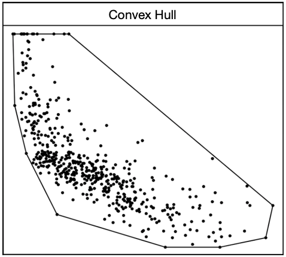
```
]

.pull-right[
.bolder[Convex hull]

- all possible edges connecting any pair of points lie entirely in the interior of the polygon or form its boundary

- Intuition: stretch a rubber band around the points

- captures a lot of white space
]

---

# Scagnostic graphs

.pull-left[
```{r echo=FALSE, out.width = "100%", fig.align='center'}
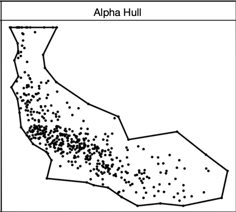
```
]

.pull-right[
.bolder[Alpha hull]

- an edge exists between any pair of points that can be touched by disk of radius alpha that contains no other points

- Intuition: roll a coin of radius $\alpha$ around your scatterplot, connect any two points that the coin touches at the same time

- captures overall shape
]

---

# Scagnostic graphs

.pull-left[
```{r echo=FALSE, out.width = "100%", fig.align='center'}
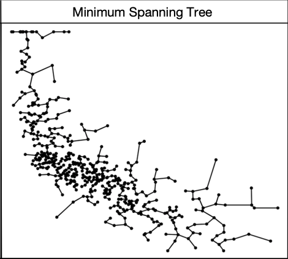
```
]

.pull-right[
.bolder[Minimum spanning tree]

- all vertices are connected by the minimum number of edges possible and any pair of vertices are connected by exactly one path

- lowest total edge length

- focuses on the interior structure
]


---

.left-column[
# Shape
## Stringy
]


.right-column[

<br>

<br>

The diameter of a MST is the longest shortest path

$c_{\text{stringy}} = \dfrac{\text{diameter}(T)}{\text{length}(T)}$

$0 \le c_{\text{stringy}} \le 1$

```{r echo=FALSE, fig.show = "hold", out.width = "33%", fig.align = "default"}
include_graphics("img/stringyLow.png")
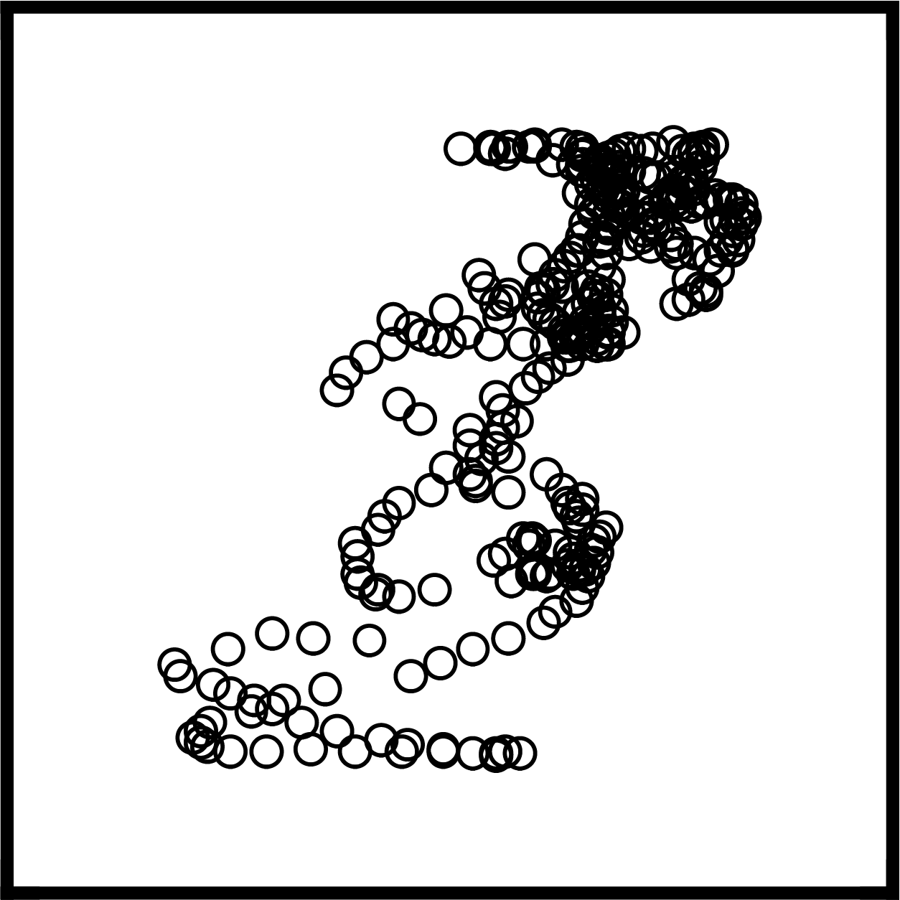
include_graphics("img/stringyHigh.png")
```
]


---

.left-column[
# Shape
## Stringy
## Skinny
]

.right-column[

<br>

<br>

$c_{\text{skinny}} = 1 - \dfrac{\sqrt{4\pi \cdot \text{area}(A)}}{\text{perimeter}(A)}$

circle:  $c_{\text{skinny}} = 0$; square: $c_{\text{skinny}} \approx 0.12$


```{r echo=FALSE, fig.show = "hold", out.width = "33%", fig.align = "default"}
include_graphics("img/skinnyLow.png")
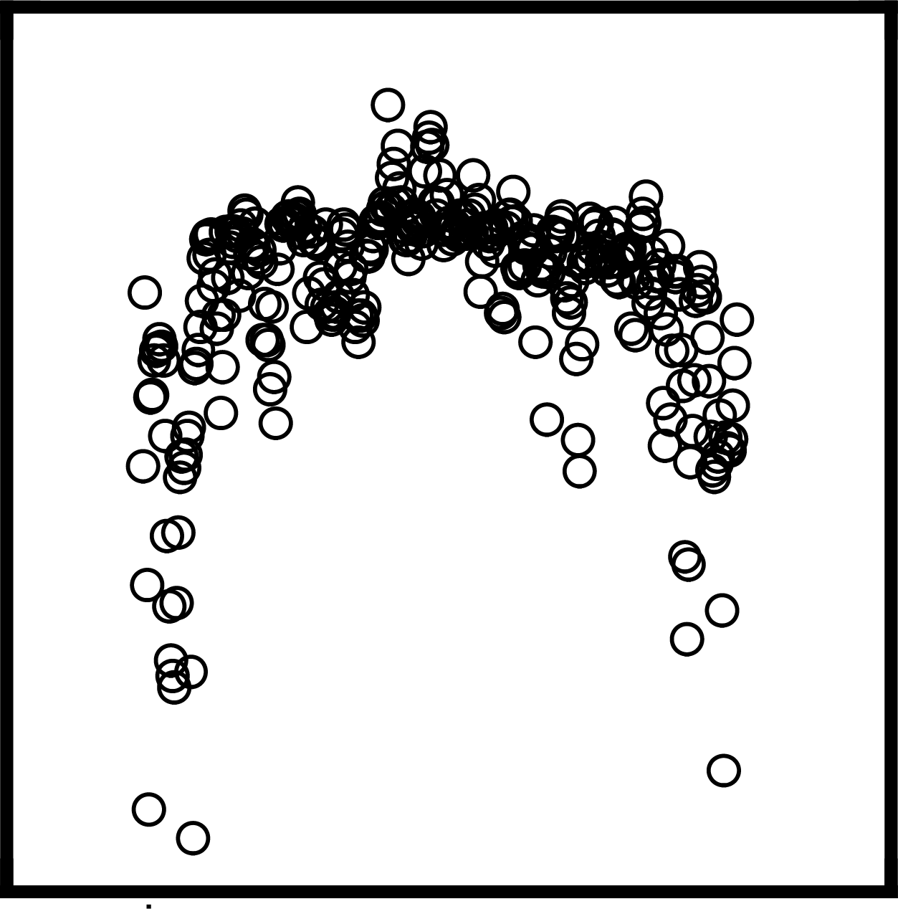
include_graphics("img/skinnyHigh.png")
```
]


---

.left-column[
# Shape

## Stringy
## Skinny
## Convex

]

.right-column[

<br>

<br>

Ratio of the areas of the alpha and convex hulls 

$c_{\text{skinny}} = \dfrac{\text{area}(A)}{\text{area}(H)}$

```{r echo=FALSE, fig.show = "hold", out.width = "33%", fig.align = "default"}
include_graphics("img/convexLow.png")
include_graphics("img/convexMedium.png")
include_graphics("img/convexHigh.png")
```
]


---

.left-column[
# Association
## Monotonic
]

.right-column[

<br>

<br>

$\qquad c_{\text{monotonic}} = r^2_{\text{Spearman}}$

```{r echo=FALSE, fig.show = "hold", out.width = "33%", fig.align = "default"}
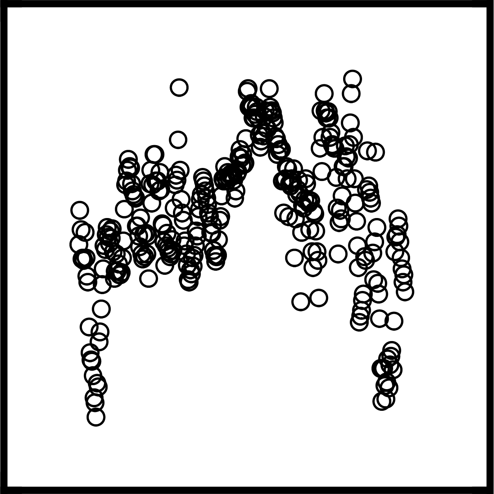
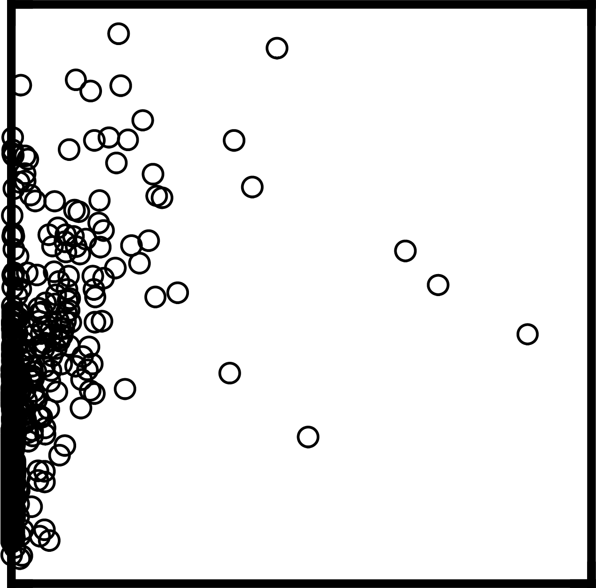
include_graphics("img/monotonicHigh.png")
```
]


---

.left-column[
# Density
## Outlying
]

.right-column[

<br>

<br>

Proportion of the total edge length due
to extremely long edges connected to singletons

Outlier criterion: $q_{.75} +1.5(q_{.75} - q_{.25})$

$c_{\text{outlying}} = \dfrac{\text{length}(T_{outliers})}{\text{length}(T)}$


```{r echo=FALSE, fig.show = "hold", out.width = "33%", fig.align = "default"}
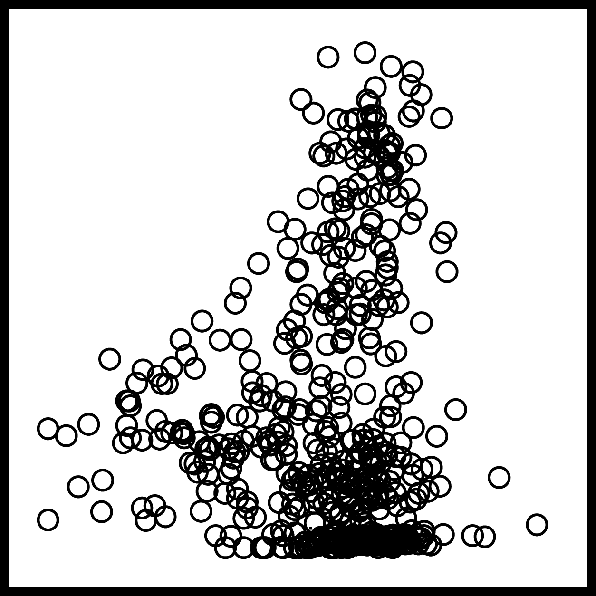
include_graphics("img/outlyingMedium.png")
include_graphics("img/outylingHigh.png")
```
]


---

.left-column[
# Density
## Outlying
## Sparse
]

.right-column[

<br>

<br>

Measures whether points in a 2D scatterplot
are confined to a lattice or a small number of locations on the plane

$c_{\text{sparse}} = q_{.9}(T)$


```{r echo=FALSE, fig.show = "hold", out.width = "33%", fig.align = "default"}
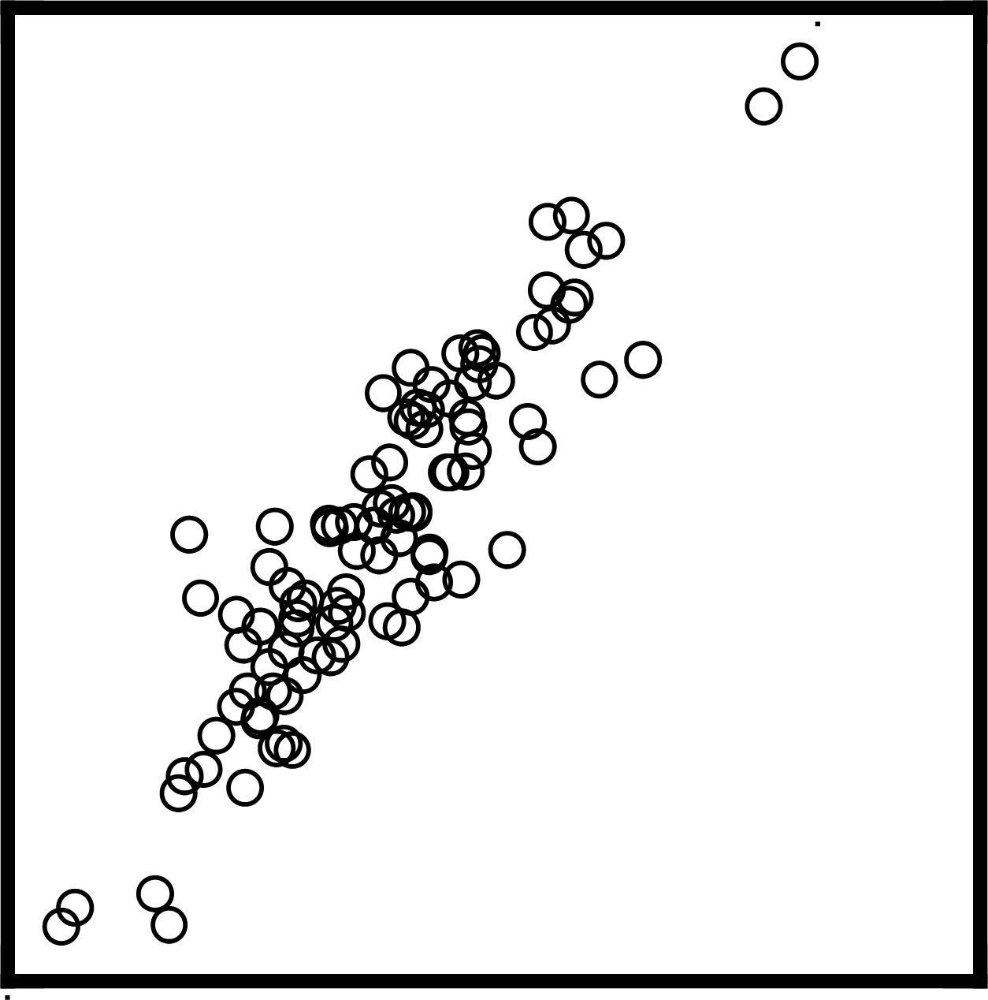
include_graphics("img/sparseMedium.png")
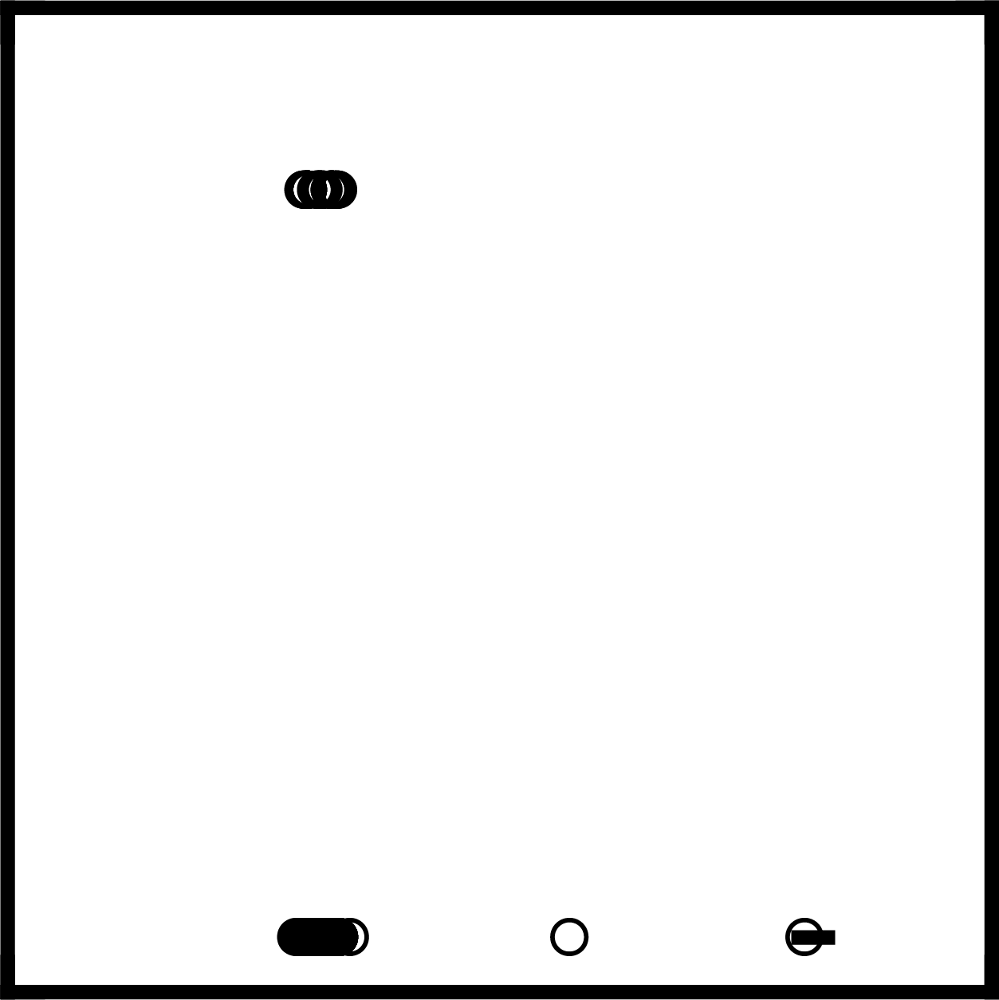
```
]


---

.left-column[
# Density
## Outlying
## Sparse
## Skewed
]

.right-column[

<br>

<br>

$c_{\text{skew}} = \dfrac{q_{.9}(T)  - q_{.5}(T)}{q_{.9}(T) - q_{.1}(T)}$


```{r echo=FALSE, fig.show = "hold", out.width = "33%", fig.align = "default"}
include_graphics("img/skewedLow.png")
include_graphics("img/skewedMedium.png")
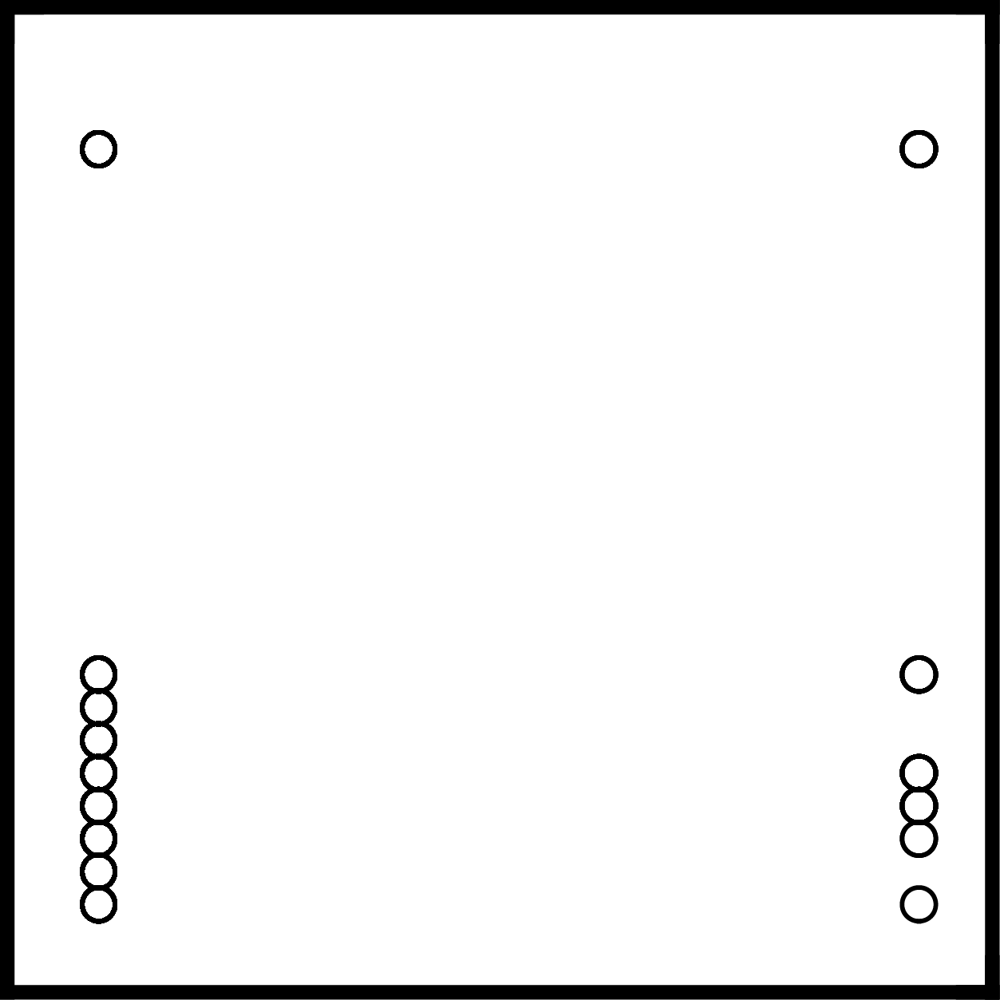
```
]


---

.left-column[
# Density
## Outlying
## Sparse
## Skewed
## Clumpy

]

.right-column[

<br>

<br>

Based on the RUNT statistic

$c_{\text{clumpy}}= \displaystyle\max_j \left[ 1 - \dfrac{\max_k(e_k)}{\text{length}(e_j)}\right]$

```{r echo=FALSE, fig.show = "hold", out.width = "33%", fig.align = "default"}
include_graphics("img/clumpyLow.png")
include_graphics("img/clumpyMedium.png")
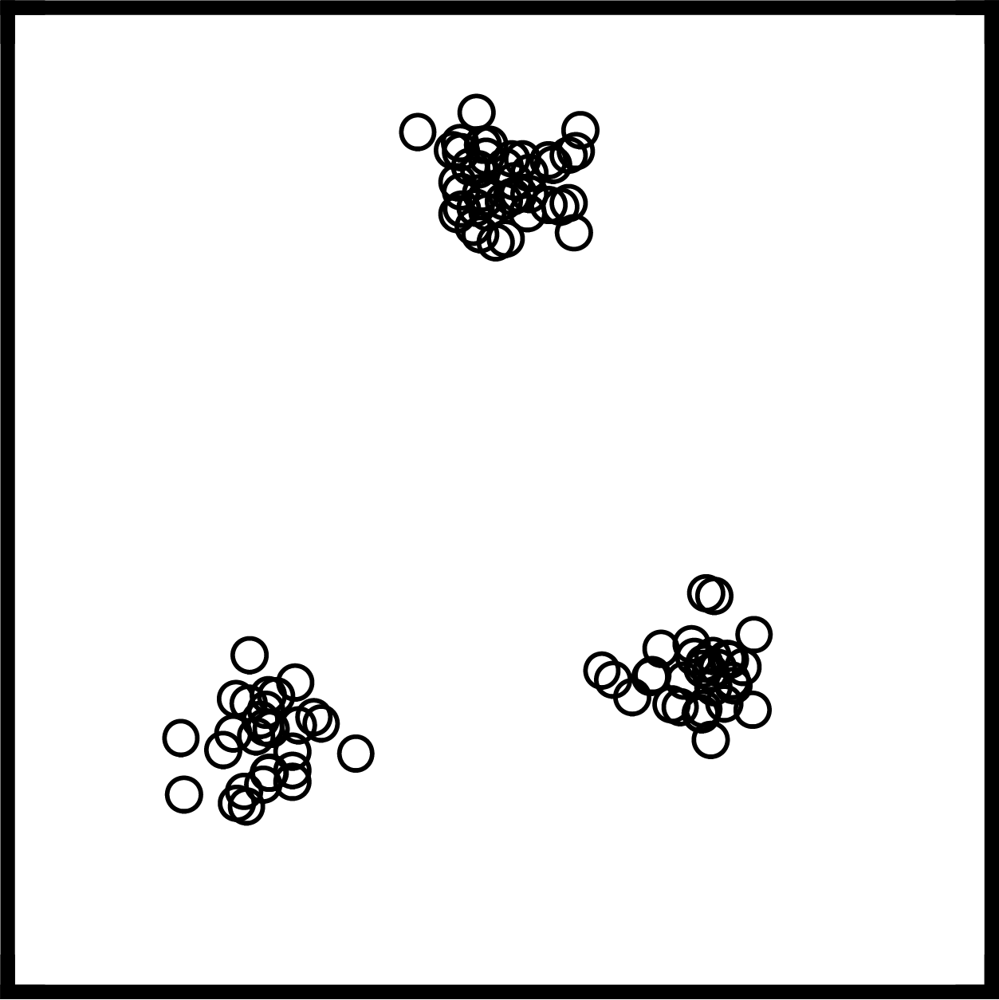
```
]


---

.left-column[
# Density
## Outlying
## Sparse
## Skewed
## Clumpy
## Striated
]

.right-column[

<br>

<br>

Number of adjacent edges whose cosine is less than −0.75

$c_{\text{clumpy}} = \dfrac{1}{|V|} \displaystyle \sum_{v \in V^{(2)}} I(\cos \theta_{e(v,a)e(v,b)} < -0.75)$

```{r echo=FALSE, fig.show = "hold", out.width = "33%", fig.align = "default"}
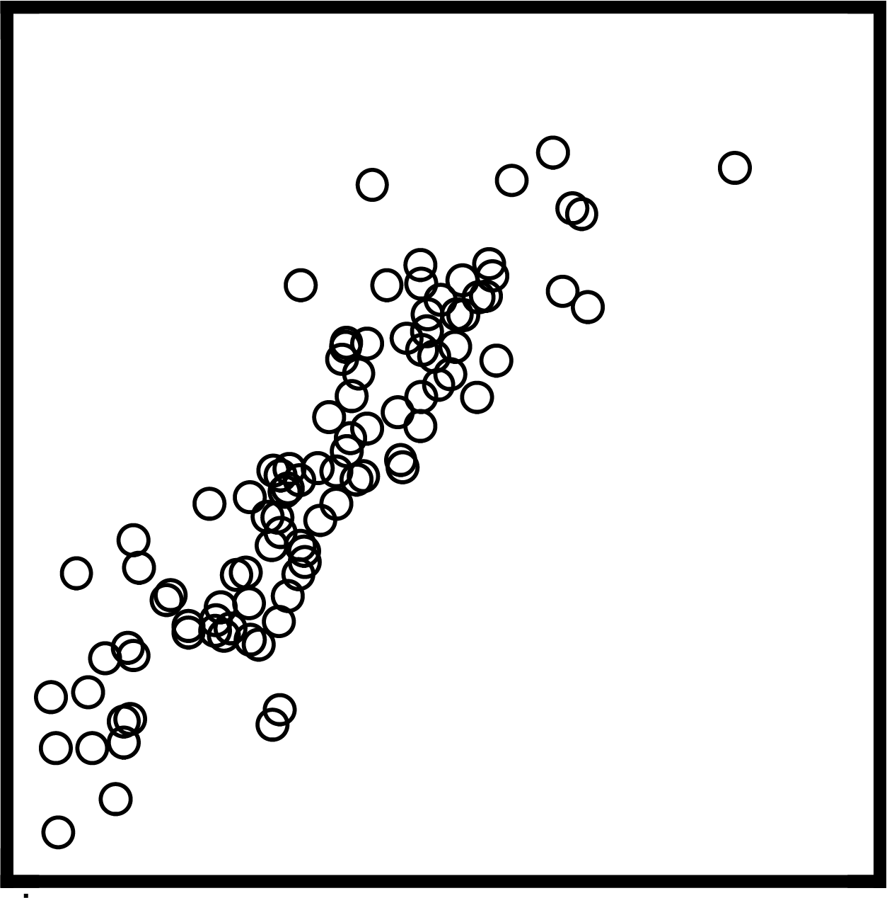
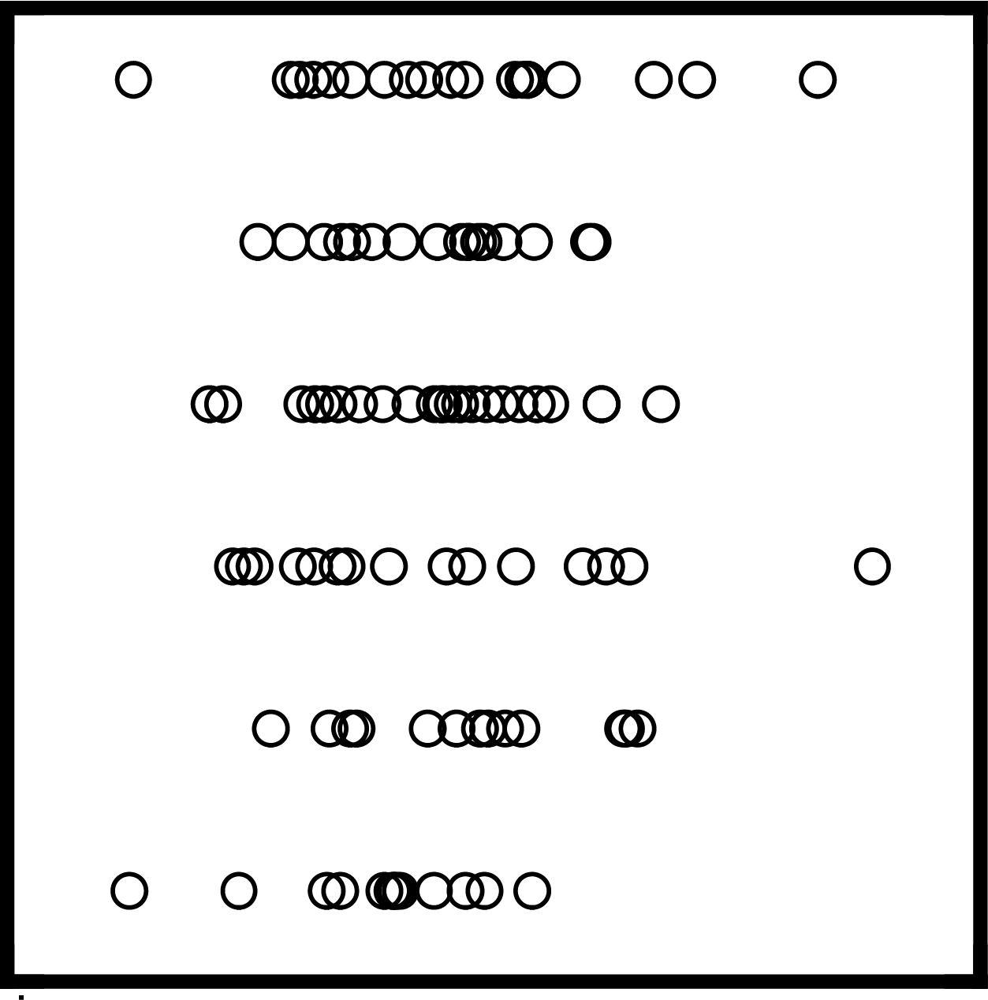
include_graphics("img/StriatedHigh.png")
```
]


---


.pull-left[
```{r echo=FALSE, fig.width=4, fig.height=4, out.width="75%", fig.align='center'}
library(datasauRus)
datasaurus_dozen %>% 
  filter(dataset == 'slant_up') %>% 
  ggplot(aes(x=x, y=y))+
  geom_point() +
  theme_minimal() +
  theme(axis.title.x=element_blank(),
        axis.text.x=element_blank(), 
        axis.ticks.x=element_blank(), axis.title.y=element_blank(),
        axis.text.y=element_blank(), axis.ticks.y=element_blank()) + 
  theme(legend.position = "none")

slant_up_df <- datasaurus_dozen %>% 
  filter(dataset == 'slant_up')
```

```{r echo=FALSE, results='asis'}
slant_scag <- as.data.frame(scagnostics(slant_up_df[,-1])[1:9])
colnames(slant_scag) <- "value"
kable(slant_scag, row.names = TRUE, format = "html", col.names = NULL, digits = 4) %>%
  row_spec(c(1, 4, 5, 9), bold = F, color = "black", background = "white") %>%
  row_spec(c(2:3, 7,8), bold = T, color = "black", background = "silver") %>%
  row_spec(6, bold = T, color = "black", background = "gainsboro")
```


]


.pull-right[
```{r echo=FALSE, fig.width=4, fig.height=4, out.width="75%", fig.align='center'}
datasaurus_dozen %>% 
  filter(dataset == 'away') %>% 
  ggplot(aes(x=x, y=y))+
  geom_point()+
  theme_minimal() +
  theme(axis.title.x=element_blank(),
        axis.text.x=element_blank(), 
        axis.ticks.x=element_blank(), axis.title.y=element_blank(),
        axis.text.y=element_blank(), axis.ticks.y=element_blank()) + 
  theme(legend.position = "none")
```

```{r echo=FALSE, results='asis'}
away_df <- datasaurus_dozen %>% 
  filter(dataset == 'away')
away_scag <- as.data.frame(scagnostics(away_df[,-1])[1:9])
colnames(away_scag) <- "value"
kable(away_scag, row.names = TRUE, format = "html", col.names = NULL, digits = 4) %>%
  row_spec(c(1, 4, 5, 9), bold = F, color = "black", background = "white") %>%
  row_spec(c(2:3, 7,8), bold = T, color = "black", background = "gainsboro") %>%
  row_spec(6, bold = T, color = "black", background = "silver")
```


]

---
background-image: url(figures/ex_random_forest.png)
background-size: contain 


# Random forests 

---

# Training data: 14865 signal plots

```{r echo=FALSE}
family_theme <- theme_light() +
  theme(panel.grid = element_blank(),
  axis.text = element_blank(), 
  axis.title = element_blank(), 
  axis.ticks = element_blank()
  )

striated_plots <- read_csv("data/striated_plots.csv")
plotSigStriate <- striated_plots[which(striated_plots$ID == 527),]


ex1 <- ggplot(plotSigStriate) + 
  geom_point(aes(x, y), shape = 1) + 
  family_theme 

linear_plots <- read_csv("data/linear2_plots.csv")
plotSigLinear <- linear_plots[which(linear_plots$ID == 530),]
ex2 <- ggplot(plotSigLinear) + 
  geom_point(aes(x, y), shape = 1) + 
  family_theme 

plotNull <- linear_plots[which(linear_plots$ID == 1866),]
ex_null <- ggplot(plotNull) +
  geom_point(aes(x, y), shape = 1) + 
  family_theme 

quad_plots <- read_csv("data/quad_plots.csv")
plotSigQuad <- quad_plots[which(quad_plots$ID == 309),]
ex3<- ggplot(plotSigQuad) + 
  geom_point(aes(x, y), shape = 1) + 
  family_theme

funnel_plots <- read_csv("data/funnel_trend_plots.csv")
plotSigFunnel <- funnel_plots[which(funnel_plots$ID == 814),]
ex4 <- ggplot(plotSigFunnel) + 
  geom_point(aes(x, y), shape = 1) + 
  family_theme

exponential_plots <- read_csv("data/Exponential_Plots.csv")
plotSigExponential <- exponential_plots[which(exponential_plots$ID == 824),]
ex5 <- ggplot(plotSigExponential) + 
  geom_point(aes(x, y), shape = 1) + 
  family_theme

cluster_plots <- read_csv("data/Cluster_Plots_Redo.csv")
plotSigCluster <- cluster_plots[which(cluster_plots$ID == 5621),]
ex6 <- ggplot(plotSigCluster) + 
  geom_point(aes(x, y), shape = 1) + 
  family_theme

ts_plots <- read_csv("data/TS_Plots.csv")

plotNullTS <- ts_plots[which(ts_plots$ID == 296),]
ex_null2 <- ggplot(plotNullTS) + 
  geom_point(aes(x, y), shape = 1) + 
  family_theme
```

```{r echo=FALSE, fig.width = 9, fig.height = 6, out.width = "100%"}
grid.arrange(ex1, ex2, ex3, ex4, ex5, ex6, ncol = 3)
```

---

#Training data: 14865 null plots

```{r echo=FALSE, fig.width = 6, fig.height = 3, fig.align='center'}
grid.arrange(ex_null, ex_null2, ncol = 2)
```

---

# Model evaluation
.large[
- Generated 1000 signal plots

- Calculated the 9 scagnostics on each

- Used random forest to classify as "signal" or "noise"
]

--

.content-box-blue[
.large[972 of the 1000 signal plots were correctly classified]
]

--

.content-box-yellow[
.large[
Also evaluated on 1000 lineups of size 20, with unspecified number of signal plots

- 93.5% of linear plots identified as signal; 5.3% false positive rate
]
]


---
class: middle, center
# Computer vision models

---
# Motivation: Giora Simchoni's blog post

```{r echo=FALSE}

```

---

## Giora trained a computer vision model two ways

.Large[
- classification: significant correlation vs not

- regression: to predict the correlation
]

---
class: clear

## Success, picked plot 16

```{r echo=FALSE, out.width = "100%"}
include_graphics("img/simchoni_test1.png")
```


---
class: clear

## Success, failed to pick plot 4

```{r echo=FALSE, out.width = "100%"}
include_graphics("img/simchoni_test2.png")
```

---
class: clear

## Fail! Doesn't see the strong nonlinear association. Picks the most linear.

```{r echo=FALSE, out.width = "90%"}
include_graphics("img/simchoni_test3.png")
```

---

# Deep learning

```{r echo=FALSE, out.width="95%", fig.align='center'}
include_graphics("img/image_classification.png")
```


.footnote[
Source: [Abdellatif Abdelfattah](https://medium.com/@tifa2up/image-classification-using-deep-neural-networks-a-beginner-friendly-approach-using-tensorflow-94b0a090ccd4)
]

---

## Neural networks

- $x_i$ = input variable

- $v_j$ = function of linear combinations of the inputs (e.g. sigmoid)

- $y_k$ = function of linear combinations of the $v_j$ (e.g. softmax)

```{r echo=FALSE, out.width = "70%", fig.align='center'}
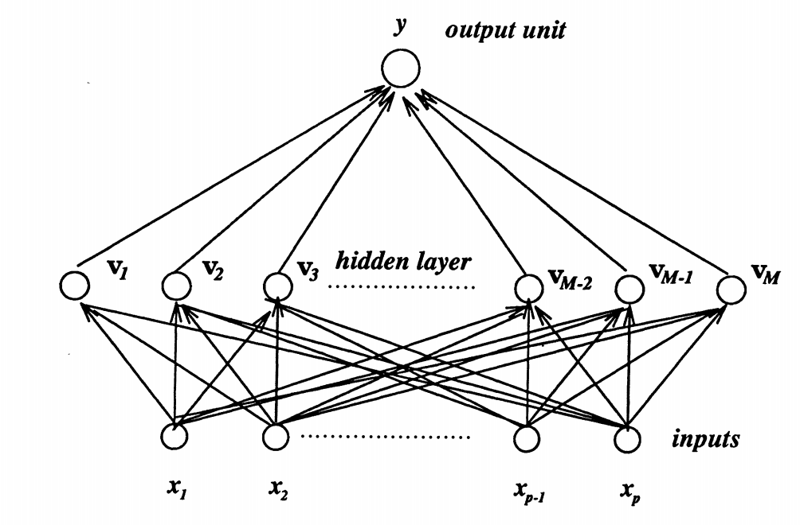
```

.footnote[
.scriptsize[Source: [Cheng & Titterington (1994)](https://projecteuclid.org/euclid.ss/1177010638)]
]
???

Derived features Zm are created from linear combinations of the inputs, and then the target Yk is modeled as a function of linear combinations of the Zm

---

# Regression as a neural network

```{r echo=FALSE, out.width = "70%", fig.align='center'}
include_graphics("img/nn_regression.png")
```

.footnote[
.scriptsize[Source: [Cheng & Titterington (1994)](https://projecteuclid.org/euclid.ss/1177010638)]
]

---

# Images as data

```{r echo=FALSE, out.width = "100%", fig.align='center'}
include_graphics("img/Corgi3.png")
```

---
background-image: url(img/nn_cat.png)
background-size: cover

---

# Filtering patterns

```{r echo=FALSE, out.width = "100%", fig.align='center'}
include_graphics("img/nn_filter.png")
```

.footnote[
Source: [Deep Learning with R](https://www.manning.com/books/deep-learning-with-r)
]

---

# Pooling to find spatial hierarchies

```{r echo=FALSE, out.width = "100%", fig.align='center'}
include_graphics("img/covnet2.jpg")
```

.footnote[
Source: Di Cook's [DSSV slides](http://www.dicook.org/files/dssv19/slides#1)
]

???
to induce spatial-filter hierarchies 

---

# Rinse & repeat to reveal other hierarchies

```{r echo=FALSE, out.width = "80%", fig.align='center'}
include_graphics("img/covnet1.jpg")
```

.footnote[
Source: Di Cook's [DSSV slides](http://www.dicook.org/files/dssv19/slides#1)
]

---

# Approach I

.large[
- Save the scatterplots as images, then train your CNN

- Di Cook and Shuofan Zhang at Monash University worked on this to detect linearity

- Trained Keras model with 60,000 training data sets for each class: linear vs. not

- Accuracy with simulated test data, 93% 
    + null error 0.0179
    + linear error 0.1176
]


---

# Approach II

.large[ 
- Create images showing the "shape" of the scatterplot, then train your CNN

.pull-left[
```{r echo=FALSE, out.width = "70%", fig.align='center'}
include_graphics("img/nn_hulls1.png")
```
]

.pull-right[
```{r echo=FALSE, out.width = "70%", fig.align='center'}
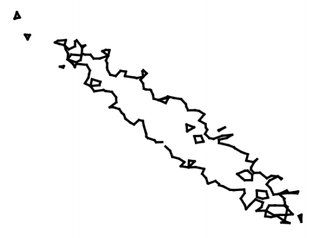
```
]

- Elliot Pickens and I worked on this last spring
]

---

# Approach II
.large[
Trained Keras model on simulated 300 plots for each class

4200 total plots in the training set

.pull-left[
- **Uniform**

- **Spherical** 

- **Binormal** 

- **Funnel** 

- **Exponential**
]

.pull-right[

- **Quadratic** 

- **Clustered** 

- **Doughnut** 

- **Stripe** 

- **Sparse** 
]
]

???
1. **Uniform** (2D Poisson process)
2. **Spherical** (spherical normal)
3. **Binormal** (bivariate normal with $\rho = \pm 0.6$)
4. **Funnel** (bivariate log-normal with $\rho = \pm 0.6$)
5. **Exponential** (exponential growth/decay plus random error)
6. **Quadratic** (positive/negative quadratic function plus random error)
7. **Clustered** (three separated spherical normals at the vertices of an equilateral triangle)
8. **Doughnut** (two polar uniforms separated by a moat of white space)
9. **Stripe** (product of Uniform and integer [1, 5])
10. **Sparse** (product of integer [1, 3] with itself)

---

## Approach II

.pull-left[
.large[
- 2100 images in the testing set (150 per class)

- Precision = true positive

- Recall = sensitivity
]
]

.pull-right[
Class | Precision | Recall
------|---|---
Uniform | 0.97 | 0.99 
Spherical | 0.70 | 0.61 
Binormal | 0.85 | 0.81 
N. Binormal | 0.96 | 0.87 
Funnel | 0.96 | 0.90 
N. Funnel | 0.94 | 0.93 
N. Expo | 0.97 | 0.99 
Expo | 0.97 | 0.97 
Quadratic | 0.96 | 0.97 
Clustered | 0.73 | 0.83 
Doughnut  | 0.73  | 0.83 
Stripe | 0.89  | 0.98 
Sparse | 1.00 | 1.00 
Logarithmic | 0.99 | 0.92 
]


???
Avg. precision and recall is  about 90%


Precision = proportion of plots classified as uniform that are actually uniform

Recall = proportion of uniform plots that were actually predicted to be uniform


---

# Discussion

.large[
- It's possible to automate the detection of plots, but the training sets are key

- If you use a statistical model/algorithm, you need to carefully consider your predictors

- Computer's haven't beaten human ability to detect plot type (Cook & Zhang)

- Promising results for model diagnosis, exploring large data sets, and prototyping new statistical graphics
]

---

# Joint work
.large[
#### Deep learning:  
[Giora Simchoni](http://giorasimchoni.com/2018/02/07/2018-02-07-book-em-danno/); [Di Cook](http://www.dicook.org/) & Shuofan Zhang; Elliot Pickens


#### Inference: 
Di Cook, Heike Hofmann, [Mahbub Majumder](http://mamajumder.github.io/html/experiments.html), Andreas Buja, Hadley Wickham, Eric Hare, [Susan Vanderplas](https://srvanderplas.netlify.com/), Niladri Roy Chowdhury, Nat Tomasetti


#### Contact: 
[`r icon::fa_envelope(color = "black")`](https://aloy.rbind.io/) aloy@carleton.edu [`r icon::fa_github(color = "black")`](https://github.com/aloy) aloy

]
---

# Further reading

.large[
- Buja et al (2009) Statistical Inference for Exploratory Data Analysis and Model Diagnostics, *Roy. Soc. Ph. Tr., A*

- Majumder et al (2013) Validation of Visual Statistical Inference, Applied to Linear Models, *JASA*

- Wickham et al (2010) Graphical Inference for Infovis, *InfoVis*

- Hofmann et al (2012) Graphical Tests for Power Comparison of Competing Design, *InfoVis*

- Loy et al (2017) Model Choice and Diagnostics for Linear Mixed-Effects Models Using Statistics on Street Corners, *JCGS*

]

