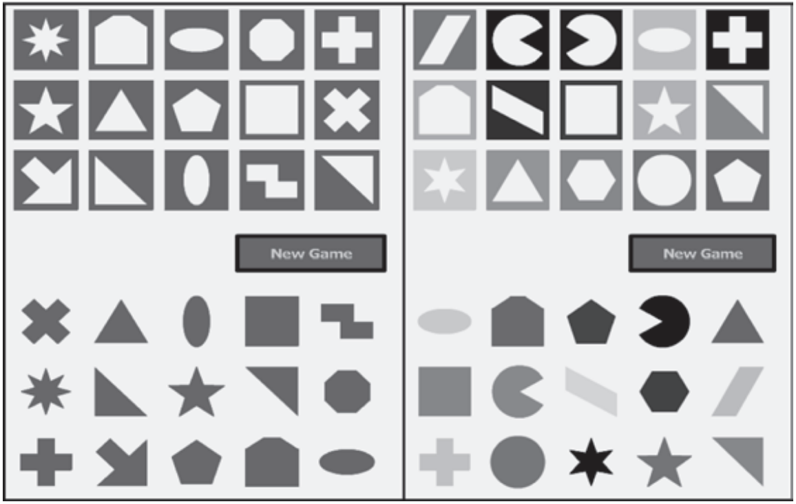
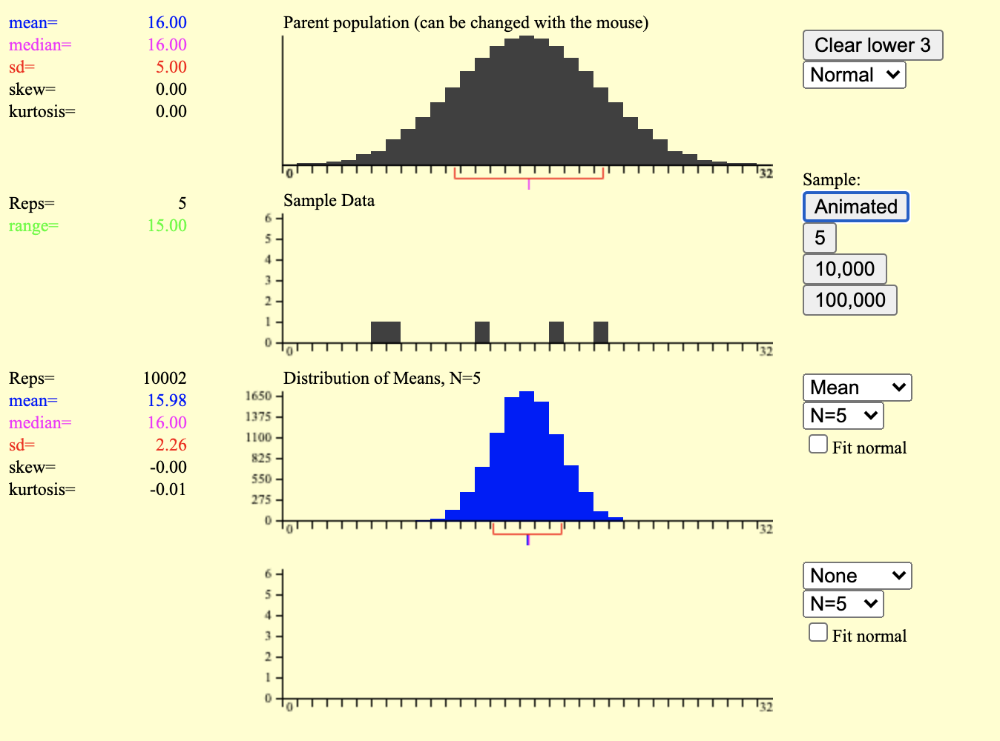
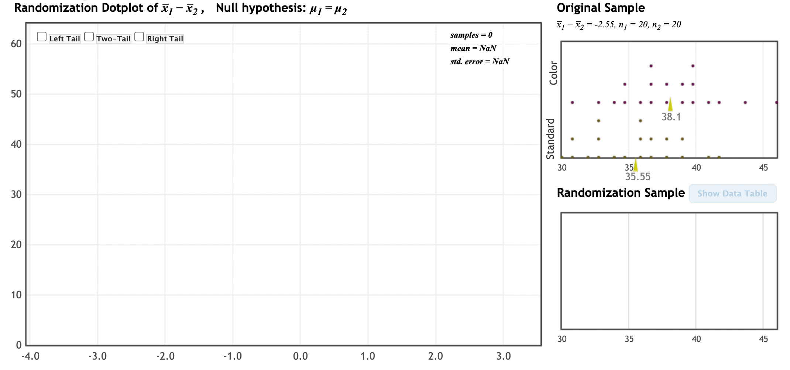
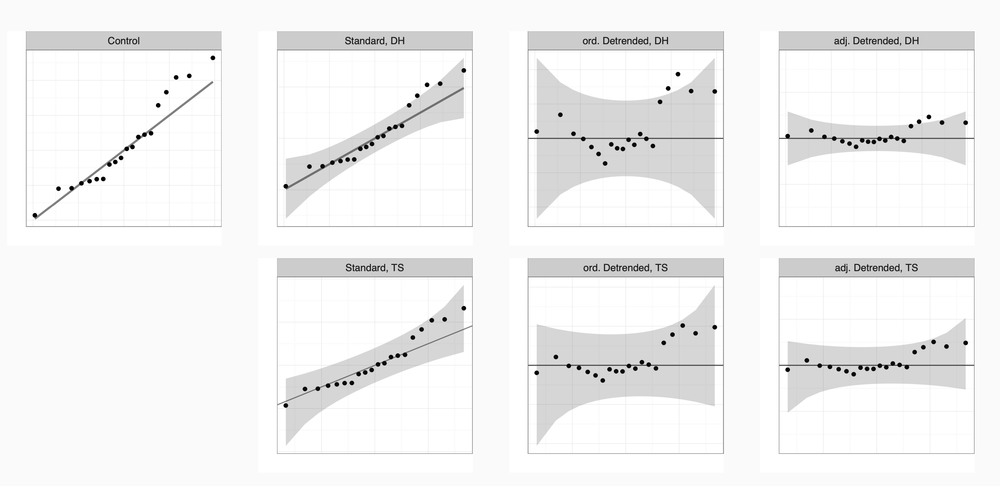
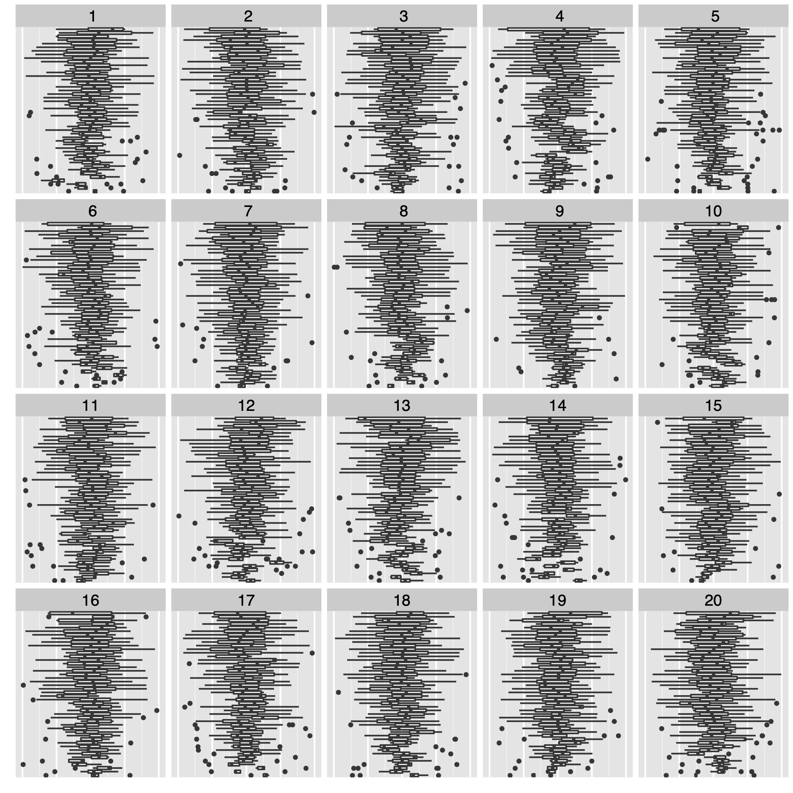
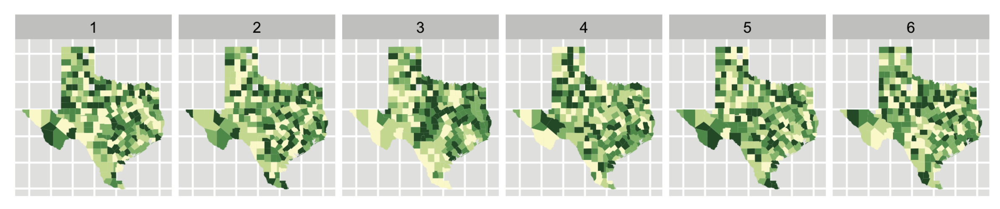

```{r setup, include=FALSE}
# options(htmltools.dir.version = FALSE)
library(knitr)
knitr::opts_chunk$set(dev = 'svg', cache = TRUE, warning = FALSE, message = FALSE, dpi = 180, error=TRUE)
library(ggplot2)
library(broom)
library(dplyr)
library(ggthemes)
library(nullabor)
library(gridExtra)
library(kableExtra)
library(infer)


library(RefManageR)
BibOptions(check.entries = FALSE,
           bib.style = "authoryear",
           cite.style = "alphabetic",
           style = "markdown",
           hyperlink = FALSE,
           dashed = FALSE)
myBib <- ReadBib("classroomVizInf.bib", check = FALSE)
```

```{r stroop sims, cache=TRUE, include=FALSE}
stroop <- read.csv("http://aloy.rbind.io/data/stroop_game.csv")

perm_dsn <-  stroop %>%
  specify(Time ~ Type) %>%
  hypothesize(null = "independence") %>%
  generate(reps = 10000, type = "permute") %>%
  calculate(stat = "diff in means", order = c("Color", "Standard"))
```

layout: true
  
<div class="my-footer"><span>aloy.rbind.io/slides/unl2020</span></div>

---

name: xaringan-title
class: left, middle, inverse

# Bringing Visual Inference to the Classroom

### Department of Statistics | University of Nebraska—Lincoln 
### 21 October 2020


<br>


.pull-left[
### Adam Loy 

### Carleton College

]

.pull-right[
.right[
### `r icon::fa("github")` @aloy

### `r icon::fa("globe")` aloy.rbind.io
]
]

---
background-image: url("img/Carleton_Aerial-4.jpg")
background-size: contain

## But first, my context at Carleton
---

background-image: url("img/Carleton_Aerial-4.jpg")
background-size: contain

## 2k undergrads | 20 stats majors | 60-70 math majors


---
class: inverse
background-image: url("img/Carleton_Aerial-4.jpg")
background-size: contain

<br>

## Intro - 8 sections/year
## Stat2 - 3
## Stat inference - 2
## Data science - 2
## Elective - 2


---


## The migration to a simulation-based curriculum

.large[
Since 2007, we've seen a shift to simulation-based inference in the intro course

- Evidence of student benefit

    + Tintle et al. 2014
    
    + Maurer & Lock 2014
    
    + Hildreth et al. 2018

- Implementation in other courses

    + Statistical inference (Cobb 2011; Chihara & Hesterberg 2011)

    + Throughout curricula (Tintle et al. 2015)
]
---

## Changes to our computational tool kit

.large[
There's also been a shift to include more accessible computation

- JMP, etc.

- Shiny apps

- Use of R for undergraduate courses

- R packages that lower barriers

    + `mosaic`
    
    + `ggformula` 
    
    + `infer` 
  ]
  
---

## Addressing GAISE recommendations

.large[
SBI

- focus on teaching statistical thinking and fostering conceptual understanding

- mathematical details later

Computational tool kit

- use tech to explore concepts & analyze data
]
---
class: middle 

.Large[Claim:]

.Large[We've made strides in helping students understand the underlying ideas of inference, .bold[BUT little has changed about the way we help students visualize inference]]

---

## Do Distracting Colors Influence the Time to Complete a Game?

- 20 students randomly assigned to the standard game (left),<br> 20 students a game with a color distracter (right)

- Subjects played the game in the same area with similar background noise

- Collected the the time, in seconds, required to complete the game

```{r echo=FALSE, out.width ="58%", fig.align='center'}

```


.footnotesize[Example taken from Kuiper and Sklar (2013). https://stat2games.sites.grinnell.edu/]

---

## Initial activity

.large[
- What competing claims are being investigated in this study?

- What do the sample data have to say?
]

```{r echo=FALSE, fig.height = 3, fig.width = 5, fig.align='center'}
ggplot(data = stroop) +
  geom_boxplot(mapping = aes(x = Type, y = Time, fill = Type), alpha = 0.5) +
  geom_point(data = stroop %>% group_by(Type) %>% summarize(Time = mean(Time)), aes(x = Type, y = Time)) +
  scale_fill_colorblind() +
  theme_light() +
  theme(legend.position = "none", axis.title.y = element_blank()) +
  coord_flip() +
  labs(x = "Time (s)")
```

.large[
- What evidence does the observed plot provide?
]

---

## What I did in 2009

```{r echo=FALSE}

```


---

## And more recently



.large[
- Look at a few resamples

- Build up a distribution that describes behavior of the statistic
]

---
background-image: url("img/app4.png")
background-size: contain

## We have more options, but has anything changed?

---

background-image: url("img/sesamestreet.png")
background-size: contain

## The lineup protocol (Buja et al., 2009)

---

## Inspiration

.large[
The classical formulation of hypothesis testing provides an established framework for inference:

1. Formulate two competing hypotheses: $H_0$ and $H_1$.

1. Choose a test statistic that characterizes the information in
the sample relevant to $H_0$.

1. Determine the distribution of the chosen statistic
when $H_0$ is true.

1. Compare the calculated test statistic to the distribution to determine whether it is "extreme."
]


---

.left-column[
<br>

Hypotheses

<br>

Test statistic

<br>

<br>

<br>

Reference distribution

<br>

<br>

<br>

Evidence against H<sub>0</sub> if...

]

.pull-left[
.bold[Simulation-based Inference]

H<sub>0</sub>: equal means

]

.bold[Visual Inference]

H<sub>a</sub>: larger mean for color distractor


---

.left-column[
<br>

Hypotheses

<br>

Test statistic

<br>

<br>

<br>

Reference distribution

<br>

<br>

<br>

Evidence against H<sub>0</sub> if...

]

.pull-left[
.bold[Simulation-based Inference]

H<sub>0</sub>: equal means

<br>

$T(x) = \overline{x}_1 - \overline{x}_2$

]

.bold[Visual Inference]

H<sub>a</sub>: larger mean for color distractor

--

```{r plot as statistic, out.width="20%", echo=FALSE, fig.height = 2, fig.width = 2}
ggplot(data = stroop) +
  geom_boxplot(mapping = aes(x = Type, y = Time, fill = Type), alpha = 0.5) +
  geom_point(data = stroop %>% group_by(Type) %>% summarize(Time = mean(Time)), aes(x = Type, y = Time)) +
  scale_fill_colorblind() +
  theme_light() +
  coord_flip() +
  theme(axis.title = element_blank(), 
        axis.ticks = element_blank(),
        axis.text = element_blank(),
        legend.position = "none")
```

---

.left-column[
<br>

Hypotheses

<br>

Test statistic

<br>

<br>

<br>

Reference distribution

<br>

<br>

<br>

Evidence against H<sub>0</sub> if...

]

.pull-left[
.bold[Simulation-based Inference]

H<sub>0</sub>: equal means

<br>

$T(x) = \overline{x}_1 - \overline{x}_2$

<br>

<br>

```{r perm-dsn, echo=FALSE, fig.height=2, fig.width=2, out.width = "45%", cache=TRUE}
perm_dsn %>%
  ggplot(aes(x = stat)) +
  geom_histogram(binwidth = .2) +
  theme_light() +
  theme(axis.title = element_blank())
```


]

.bold[Visual Inference]

H<sub>a</sub>: larger mean for color distractor

```{r plot as statistic, out.width="20%", echo=FALSE, fig.height = 2, fig.width = 2}
```

--

```{r , dev = 'svg', echo=FALSE, fig.height = 5, fig.width = 6.5, out.width = "33%"}
lineup1
```

---

.left-column[
<br>

Hypotheses

<br>

Test statistic

<br>

<br>

<br>

Reference distribution

<br>

<br>

<br>

Evidence against H<sub>0</sub> if...

]

.pull-left[
.bold[Simulation-based Inference]

H<sub>0</sub>: equal means

<br>

$T(x) = \overline{x}_1 - \overline{x}_2$

<br>

<br>

```{r, echo=FALSE, fig.height=2, fig.width=2, out.width = "45%"}
perm_dsn %>%
  ggplot(aes(x = stat)) +
  geom_histogram(binwidth = .2) +
  theme_light() +
  theme(axis.title = element_blank()) +
  geom_vline(xintercept = 2.5, color = "darkorange")

```

<br>


the test statistic is "extreme"

]

.bold[Visual Inference]

H<sub>a</sub>: larger mean for color distractor

```{r plot as statistic, out.width="20%", echo=FALSE, fig.height = 2, fig.width = 2}
```

```{r , dev = 'svg', echo=FALSE, fig.height = 5, fig.width = 6.5, out.width = "33%"}
stroop_lineup %>%
  ggplot(aes(x = Type, y = Time, fill = Type)) +
  geom_rect(data = subset(stroop_lineup, .sample == true_pos), xmin = -Inf, xmax = Inf, ymin = -Inf, ymax = Inf, alpha = 0.3, fill = "gray80") +
  geom_boxplot(alpha = 0.5) +
  geom_point(data = stroop_means, aes(x = Type, y = .mean)) +
  facet_wrap(~ .sample, ncol = 5) + 
  theme_bw() +
  theme(legend.position = "none", axis.title.y = element_blank(),
        panel.grid = element_blank()) +
  coord_flip() +
  labs(x = "Time (s)") +
  scale_fill_colorblind()
```

--

the data plot is identifiable


---


.Large[Choose which plot is most different from the others and justify your choice]

```{r stroop-lineup, echo=FALSE, fig.height = 5.5, fig.width = 7.5, out.width="95%"}
set.seed(1234)
stroop_lineup <- stroop %>%
  lineup(method = null_permute("Type"), true = ., n = 20)

true_pos <- 13

stroop_means <- stroop_lineup %>%
  group_by(.sample, Type) %>%
  summarize(.mean = mean(Time)) %>%
  ungroup()

lineup1 <- stroop_lineup %>%
  ggplot(aes(x = Type, y = Time, fill = Type)) +
  geom_boxplot(alpha = 0.5) +
  geom_point(data = stroop_means, aes(x = Type, y = .mean)) +
  facet_wrap(~ .sample, ncol = 5) + 
  theme_bw() +
  theme(legend.position = "none", 
        axis.title.y = element_blank(),
        panel.grid = element_blank()) +
  coord_flip() +
  labs(x = "Time (s)") +
  scale_fill_colorblind()
  
lineup1
```

---

.Large[Choose which plot is most different from the others and justify your choice]

```{r stroop_lineup_highlighted, echo=FALSE, fig.height = 5.5, fig.width = 7.5, out.width="95%"}
stroop_lineup %>%
  ggplot(aes(x = Type, y = Time, fill = Type)) +
  geom_rect(data = subset(stroop_lineup, .sample == true_pos), xmin = -Inf, xmax = Inf, ymin = -Inf, ymax = Inf, alpha = 0.3, fill = "gray80") +
  geom_boxplot(alpha = 0.5) +
  geom_point(data = stroop_means, aes(x = Type, y = .mean)) +
  facet_wrap(~ .sample, ncol = 5) + 
  theme_bw() +
  theme(legend.position = "none", axis.title.y = element_blank(),
        panel.grid = element_blank()) +
  coord_flip() +
  labs(x = "Time (s)") +
  scale_fill_colorblind()
  
```

---

## Questioning the response

.large[
- Did you/your group choose the observed data?

- How do your choices relate to the hypotheses?

- Do you think there is a discernible difference?
]

.footnote[See Witmer (2019) for discussion of "discernable" vs. "significant"]
---

## What did we just do?

.large[
- We compared the **data plot** with **null plots** of samples where, by construction, there is no association

- Compared what we observe to what we would expect under the null

- All of this is done using "Sesame Street logic" to make a decision
]
---

## What didn't we do?

.large[
- Define a null/sampling/permutation distribution

- Discuss details of permutation resampling

- Discuss validity conditions (yet)

- Formally quantify evidence


]

---

class: middle, clear

# Where else is the lineup protocol useful?

---
class: middle

# apophenia

### the tendency to perceive a connection or meaningful pattern between unrelated or random things (such as objects or ideas)


.footnote[
"apophenia" Meriam-Webster Dictionary Online, September 2019, merriam-webster.com
]


---

## Interpreting residual plots


.pull-left[

$\widehat{\tt heart.rate} = b_0 + b_1 \cdot {\tt duration}$

```{r pengiun-scatter, echo=FALSE, fig.height = 4, fig.width = 4}
penguins <- read.csv("http://aloy.rbind.io/data/penguins.csv") 
mod <- lm(log(heart.rate) ~ duration, data = penguins)
aug <- augment(mod)

penguins %>%
  ggplot(aes(x = log(heart.rate), y = duration)) +
  geom_point(shape = 1) +
  geom_smooth(method = "lm") +
  labs(x = "duration of dive (minutes)", 
       y = "heart rate (bpm, log scale)") +
  theme_bw()
```
]

.pull-right[

Is there any evidence of structure?

```{r penguin-residuals, echo=FALSE, fig.height = 4, fig.width = 4}
aug %>%
  ggplot(aes(x = duration, y = .resid)) +
  geom_hline(yintercept = 0, linetype = 2, color = "gray30") +
  geom_point(shape = 1) +
  labs(x = "duration of dive (minutes)", y = "Residuals") +
  theme_bw()
```
]


---

### Does the observed residual plot stand out?

```{r resid lineup, echo=FALSE, fig.height = 6, fig.width = 8.5}
# fig.height = 7, fig.width = 9 for full slide
library(nullabor)
set.seed(6789)
lineup_resids <- lineup(null_lm(log.heart.rate. ~ duration, method = "boot"), true = aug)

resid_lineup <- lineup_resids %>%
  ggplot(aes(x = duration, y = .resid)) +
  # geom_rect(data = subset(lineup_resids, .sample == 3), xmin = -Inf, xmax = Inf, ymin = -Inf, ymax = Inf, alpha = 0.3, fill = "gray80") +
  geom_hline(yintercept = 0, color = "gray60", linetype = 2) +
  geom_point(shape = 1) +
  facet_wrap(~ .sample) +
  theme_bw() +
  theme(axis.title = element_blank(), 
        axis.ticks = element_blank(),
        axis.text = element_blank())
resid_lineup
```

---

### Does the observed residual plot stand out?

```{r resid lineup answer, echo=FALSE, fig.height = 6, fig.width = 8.5}
lineup_resids %>%
  ggplot(aes(x = duration, y = .resid)) +
  geom_rect(data = subset(lineup_resids, .sample == 3), xmin = -Inf, xmax = Inf, ymin = -Inf, ymax = Inf, alpha = 0.3, fill = "gray80") +
  geom_hline(yintercept = 0, color = "gray60", linetype = 2) +
  geom_point(shape = 1) +
  facet_wrap(~ .sample) +
  theme_bw() +
  theme(axis.title = element_blank(), 
        axis.ticks = element_blank(),
        axis.text = element_blank())
```

---

## Discussion questions

.large[
- What panel did you choose?

- Describe the patterns you observe in three null plots

- Is the observed plot systematically different from the null plots? If so, how?
]


---

## Interpreting mosaic plots

.large[Is there evidence of an association?]

```{r echo=FALSE, fig.height= 4, fig.width = 7, fig.align='center'}
data("fly", package = "ggmosaic")

fly_data <- fly %>%
  select(gender, rude_to_bring_baby) %>%
  na.omit()

library(ggmosaic)

ggplot(data = fly_data) +
  geom_mosaic(aes(x = product(gender, rude_to_bring_baby), fill=gender)) + 
  scale_fill_colorblind("Is it rude to\nbring a baby\non a plane?") +
  theme_bw() +
  theme(axis.title.x = element_blank())

```


---
class: clear

### Is it rude to bring a baby on a plane?

```{r bar lineup, echo=FALSE, fig.height = 6, fig.width = 8.5}

bar_lineup_data <- lineup(method = null_permute("rude_to_bring_baby"), true = fly_data) 

bar_lineup <- bar_lineup_data %>%
  ggplot() +
  # geom_rect(data = subset(lineup_resids, .sample == 19), xmin = -Inf, xmax = Inf, ymin = -Inf, ymax = Inf, alpha = 0.3, fill = "gray80") +
    geom_mosaic(aes(x = product(gender, rude_to_bring_baby), fill=gender)) +
  facet_wrap(~ .sample, ncol = 5) +
  scale_fill_colorblind("Is it rude to\nbring a baby\non a plane?") +
  theme_bw() +
  theme(legend.position = "top", 
        axis.title.y = element_blank(),
        axis.title.x = element_blank(),
        panel.grid = element_blank())
  # theme(axis.title = element_blank())
bar_lineup
```

???

Observed plot: `r attr(bar_lineup_data, "pos")`

---

## Checking a logistic regression model

Examining plots of $\widehat{p}_{adj}$ vs. predictors (Cannon et al. 2019)

$$
\widehat{p}_{\rm adj} = \frac{\text{number successes} + 0.5}{\text{number of cases} + 1},
$$

.pull-left[
```{r echo=FALSE, fig.height = 4, fig.width = 4}
data("MedGPA", package = "Stat2Data")
medgpa_mod <- glm(Acceptance~GPA, data=MedGPA, family = "binomial")
emplogitplot1(MedGPA$Acceptance ~ MedGPA$GPA, showplot = FALSE, out = TRUE, ngroups = 5) %>%
  ggplot(aes(x = XMean, y = Logit)) +
  geom_point() +
  geom_smooth(method = "lm", se = FALSE) +
  labs(y = "Empirical logit", x = "Average GPA") + theme_bw()
```
]

.pull-right[
```{r echo=FALSE, fig.height = 4, fig.width = 4}
emplogitplot1(MedGPA$Acceptance ~ MedGPA$GPA, showplot = FALSE, out = TRUE, ngroups = 11) %>%
  ggplot(aes(x = XMean, y = Logit)) +
  geom_point() +
  geom_smooth(method = "lm", se = FALSE) +
  labs(y = "Empirical logit", x = "Average GPA") + theme_bw()
```
]


---
class: clear

### Are the empirical odds linear?

```{r echo=FALSE, fig.height = 6, fig.width = 8.5}
library(Stat2Data)
library(dplyr)
library(purrr)
data("MedGPA")
set.seed(325798)

# fitted model
medgpa_mod <- glm(Acceptance~GPA, data=MedGPA, family = "binomial")

# simulate Ys for 19 null plots
medgpa_lineup <- replicate(19, expr = simulate(medgpa_mod), simplify = FALSE)
medgpa_lineup[[20]] <- data.frame(sim_1 = MedGPA[["Acceptance"]])

# lineup data set generation
medgpa_lineup_df <- 
  medgpa_lineup %>%
  map(~emplogitplot1(.x[[1]] ~ MedGPA$GPA, showplot = FALSE, out = TRUE, ngroups = 5)) %>%
  bind_rows(.id = ".sample") %>%
  mutate(.id = sample(20, size = 20, replace = FALSE) %>% rep(., each = 5))

medgpa_lineup_df %>%
  ggplot(aes(x = XMean, y = Logit)) +
    # geom_rect(data = subset(medgpa_lineup_df, .id == 7), xmin = -Inf, xmax = Inf, ymin = -Inf, ymax = Inf, alpha = 0.3, fill = "gray80") +
  geom_smooth(method = "lm", se = FALSE, size = 0.8, color = "gray60", linetype = 2) +
  geom_point() +
  labs(y = "Empirical logit", x = "X") +
  facet_wrap(~ .id) +
  theme_bw()
```

---
class: clear

### Are the empirical odds linear?

```{r echo=FALSE, fig.height = 6, fig.width = 8.5}

medgpa_lineup_df %>%
  ggplot(aes(x = XMean, y = Logit)) +
  geom_rect(data = subset(medgpa_lineup_df, .id == 7), xmin = -Inf, xmax = Inf, ymin = -Inf, ymax = Inf, alpha = 0.3, fill = "gray80") +
  geom_smooth(method = "lm", se = FALSE, size = 0.8, color = "gray60", linetype = 2) +
  geom_point() +
  labs(y = "Empirical logit", x = "X") +
  facet_wrap(~ .id) +
  theme_bw()
```

---

## Teaching design of experiments

.large[Which Q-Q plot design is the most powerful?]

```{r echo=FALSE}

```

.footnote[Example from Loy et al (2016)]

---

## Teaching design of experiments

.large[
Procedure from Hofmann et al. (2012)

<br>
1. Create lineup data: signal panel; 19 noise panels 

2. Create lineups from competing designs

3. Observers evaluate lineups

4. Evaluate competing designs

<br>

Provides a springboard to discussions about protocols, design, and analysis
]
---

## Checking a linear mixed-effects model

Conventional tools for model selection/validation encounter problems when we work with finite samples, e.g.

- Residual plots display artificial structure

- No test to detect heteroscedasticity of the error terms with small group sizes

- Distribution of the predicted random effects does not match the theoretical distribution


.footnote[
Loy et al (2017)
]

---

## Is there evidence of heteroscedastic errors?

```{r echo=FALSE, out.width ="70%", fig.align='center'}

```


---

### Is there spatial association in this chloropleth map?

```{r echo=FALSE}

```

.footnote[Wickham et al (2010)]


---


## How to create lineups

.large[

Suite of Shiny apps:

`r icon::fa("globe")` https://aloy.rbind.io/project/classroom-viz-inf/

`r icon::fa("github")` https://github.com/aloy/shiny-vizinf
]

---

## How to create lineups

.large[
In R: `nullabor` + `tidyverse` tools

`r icon::fa("github")` Tutorial: https://aloy.github.io/classroom-vizinf/
]

```{r eval=FALSE}
library(nullabor)
library(tidyverse)
stroop %>%
  lineup(method = null_permute("Type"), true = ., n = 20) %>% #<<
  ggplot(aes(x = Type, y = Time, fill = Type)) +
  geom_boxplot(alpha = 0.5) +
  coord_flip() +
  facet_wrap(~ .sample, ncol = 5) +
  scale_fill_colorblind()
```

```
decrypt("vkyo RpNp l2 6UtlNlU2 uA")
```

.footnote[StatTLC blogpost: https://stattlc.com/2019/10/30/intro-visual-inference/]

---

## Conclusions

.large[

The lineup...

- introduces students to logic behind testing without need for technical discussions

- fosters accessible discussions about statistical ideas

- provides a framework to help students interpret new statistical graphics

- is a rigorous tool for statistical investigation later in the curriculum
]

.footnote[
Preprint - https://arxiv.org/abs/2006.11345
]
---

## References: Visual inference

- Buja et al (2009) Statistical Inference for Exploratory Data Analysis and Model Diagnostics, *Roy. Soc. Ph. Tr., A*

- Majumder et al (2013) Validation of Visual Statistical Inference, Applied to Linear Models, *JASA*

- Wickham et al (2010) Graphical Inference for Infovis, *InfoVis*

- Hofmann et al (2012) Graphical Tests for Power Comparison of Competing Design, *InfoVis*

- Loy et al (2017) Model Choice and Diagnostics for Linear Mixed-Effects Models Using Statistics on Street Corners, *JCGS*

---

## References: R packages

- Pruim et al (2017) The mosaic Package: Helping
  Students to 'Think with Data' Using R. \emph{The R Journal}
  
- Daniel Kaplan & Randall Pruim (2020). ggformula: Formula Interface
  to the Grammar of Graphics. 
  
-  Andrew Bray et al (2020). infer: Tidy Statistical Inference.
  
- `nullabor` - see Buja et al (2009)

---

## References: Simulation-based curricula

- Cobb (2007) The introductory statistics course: a ptolemaic curriculum? *TISE*

- Cobb (2011) Teaching statistics: Some important tensions, *Chilean J. Stat.*

- Chihara & Hesterberg (2011) *Mathematical Statistics with Resampling and R*, Wiley

- Tintle et al. (2014) Quantitative evidence for the use of simulation and randomization in the introductory statistics course, *ICOTS9*

- Maurer & Lock (2014) Comparison of learning outcomes for randomization-based and traditional inference curricula in a designed educational experiment, *TISE*

- Tintle et al. (2015) Combating Anti-Statistical thinking using simulation-based methods throughout the undergraduate curriculum, *TAS*

- Hildreth at al. (2018) Comparing student success and understanding in introductory statistics under consensus and Simulation-Based curricula, *SERJ*

